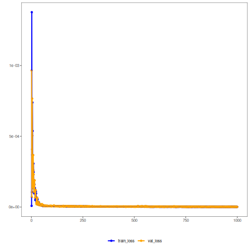

## Stacked Autoencoder transformation (encode-decode)

Considering a dataset with $p$ numerical attributes. 

The goal of the autoencoder is to reduce the dimension of $p$ to $k$, such that these $k$ attributes are enough to recompose the original $p$ attributes. However from the $k$ dimensionals the data is returned back to $p$ dimensions. The higher the quality of autoencoder the similiar is the output from the input. 


```r
# DAL ToolBox
# version 1.1.737


#loading DAL
library(daltoolbox)
library(ggplot2)
```

### dataset for example 


```r
data(sin_data)

sw_size <- 5
ts <- ts_data(sin_data$y, sw_size)

ts_head(ts)
```

```
##             t4        t3        t2        t1        t0
## [1,] 0.0000000 0.2474040 0.4794255 0.6816388 0.8414710
## [2,] 0.2474040 0.4794255 0.6816388 0.8414710 0.9489846
## [3,] 0.4794255 0.6816388 0.8414710 0.9489846 0.9974950
## [4,] 0.6816388 0.8414710 0.9489846 0.9974950 0.9839859
## [5,] 0.8414710 0.9489846 0.9974950 0.9839859 0.9092974
## [6,] 0.9489846 0.9974950 0.9839859 0.9092974 0.7780732
```

### applying data normalization


```r
preproc <- ts_norm_gminmax()
preproc <- fit(preproc, ts)
ts <- transform(preproc, ts)

ts_head(ts)
```

```
##             t4        t3        t2        t1        t0
## [1,] 0.5004502 0.6243512 0.7405486 0.8418178 0.9218625
## [2,] 0.6243512 0.7405486 0.8418178 0.9218625 0.9757058
## [3,] 0.7405486 0.8418178 0.9218625 0.9757058 1.0000000
## [4,] 0.8418178 0.9218625 0.9757058 1.0000000 0.9932346
## [5,] 0.9218625 0.9757058 1.0000000 0.9932346 0.9558303
## [6,] 0.9757058 1.0000000 0.9932346 0.9558303 0.8901126
```

### spliting into training and test


```r
samp <- ts_sample(ts, test_size = 10)
train <- as.data.frame(samp$train)
test <- as.data.frame(samp$test)
```

### creating autoencoder
Reduce from 5 to 3 dimensions


```r
auto <- autoenc_stacked_ed(5, 3)

auto <- fit(auto, train)
```

### learning curves


```r
fit_loss <- data.frame(x=1:length(auto$train_loss), train_loss=auto$train_loss,val_loss=auto$val_loss)

grf <- plot_series(fit_loss, colors=c('Blue','Orange'))
plot(grf)
```



### testing autoencoder
presenting the original test set and display encoding


```r
print(head(test))
```

```
##          t4        t3        t2        t1        t0
## 1 0.7258342 0.8294719 0.9126527 0.9702046 0.9985496
## 2 0.8294719 0.9126527 0.9702046 0.9985496 0.9959251
## 3 0.9126527 0.9702046 0.9985496 0.9959251 0.9624944
## 4 0.9702046 0.9985496 0.9959251 0.9624944 0.9003360
## 5 0.9985496 0.9959251 0.9624944 0.9003360 0.8133146
## 6 0.9959251 0.9624944 0.9003360 0.8133146 0.7068409
```

```r
result <- transform(auto, test)
print(head(result))
```

```
##           [,1]      [,2]      [,3]      [,4]      [,5]
## [1,] 0.7259116 0.8307405 0.9148690 0.9708428 1.0007207
## [2,] 0.8295371 0.9138107 0.9727781 0.9996296 0.9989017
## [3,] 0.9138449 0.9715073 0.9995587 0.9970725 0.9630728
## [4,] 0.9716352 0.9995402 0.9976902 0.9637343 0.9005114
## [5,] 0.9987441 0.9957970 0.9654322 0.9014103 0.8144276
## [6,] 0.9961512 0.9638276 0.9022303 0.8150095 0.7079045
```


```r
result <- as.data.frame(result)
names(result) <- names(test)
r2 <- c()
mape <- c()
for (col in names(test)){
r2_col <- cor(test[col], result[col])^2
r2 <- append(r2, r2_col)
mape_col <- mean((abs((result[col] - test[col]))/test[col])[[col]])
mape <- append(mape, mape_col)
print(paste(col, 'R2 test:', r2_col, 'MAPE:', mape_col))
}
```

```
## [1] "t4 R2 test: 0.999950740886664 MAPE: 0.000746669702689911"
## [1] "t3 R2 test: 0.999978462407166 MAPE: 0.00132745134928353"
## [1] "t2 R2 test: 0.999991571625765 MAPE: 0.00247042598322234"
## [1] "t1 R2 test: 0.999992051697964 MAPE: 0.001757689886398"
## [1] "t0 R2 test: 0.999988721359091 MAPE: 0.00260401043426043"
```

```r
print(paste('Means R2 test:', mean(r2), 'MAPE:', mean(mape)))
```

```
## [1] "Means R2 test: 0.99998030959533 MAPE: 0.00178124947117084"
```

