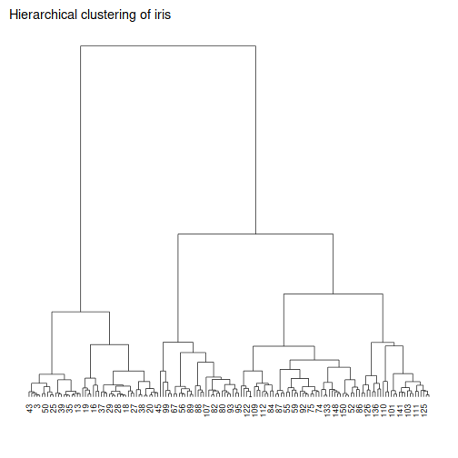

About the method
- `cluster_hclust`: agglomerative hierarchical clustering.

Didactic goal: keep the same clustering line of experiment and add a hierarchy that can be inspected before or after cutting the tree into clusters.

Environment setup.

``` r
source(url("https://raw.githubusercontent.com/cefet-rj-dal/daltoolbox/main/examples/seed.R"))
# install.packages("daltoolbox")

library(daltoolbox)
```

Load data and separate predictors from the reference labels used only for interpretation.

``` r
iris <- datasets::iris
x <- iris[, 1:4]
ref <- iris$Species
head(x)
```

```
##   Sepal.Length Sepal.Width Petal.Length Petal.Width
## 1          5.1         3.5          1.4         0.2
## 2          4.9         3.0          1.4         0.2
## 3          4.7         3.2          1.3         0.2
## 4          4.6         3.1          1.5         0.2
## 5          5.0         3.6          1.4         0.2
## 6          5.4         3.9          1.7         0.4
```

Model configuration.

``` r
model <- cluster_hclust(k = 3, method = "ward.D2")
```

Fit the model and obtain cluster labels.

``` r
model <- daltoolbox::fit(model, x)
clu <- daltoolbox::cluster(model, x)
table(clu)
```

```
## clu
##  1  2  3 
## 49 30 71
```

Evaluate the partition.

``` r
eval <- daltoolbox::evaluate(model, clu, ref)
eval
```

```
## $clusters_entropy
## # A tibble: 3 × 4
##   x        ce   qtd   ceg
##   <fct> <dbl> <int> <dbl>
## 1 1     0        49 0    
## 2 2     0.561    30 0.112
## 3 3     0.909    71 0.430
## 
## $clustering_entropy
## [1] 0.5422445
## 
## $data_entropy
## [1] 1.584963
## 
## $metrics
##                metric      value     goal     type
## 1          silhouette  0.5030502 maximize internal
## 2      davies_bouldin  0.6826395 minimize internal
## 3   calinski_harabasz 11.0271758 maximize internal
## 4             entropy  0.5422445 minimize external
## 5              purity  0.8266667 maximize external
## 6 adjusted_rand_index  0.6153230 maximize external
```

Inspect the hierarchy graphically.

``` r
grf <- daltoolbox::plot_dendrogram(model$hc, title = "Hierarchical clustering of iris")
plot(grf)
```



References
- Johnson, S. C. (1967). Hierarchical Clustering Schemes.
