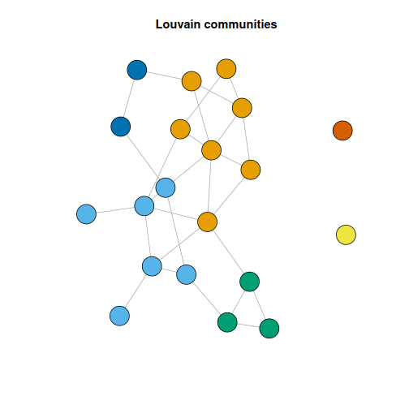

About the method
- `cluster_louvain_graph`: graph community detection by modularity optimization.

Didactic goal: show the most important exception inside the clustering family. The workflow still follows the same DAL rhythm, but the input is now a graph instead of a feature matrix, and the interpretation is about communities rather than geometric groups.

Environment setup.

``` r
source(url("https://raw.githubusercontent.com/cefet-rj-dal/daltoolbox/main/examples/seed.R"))
# install.packages(c("daltoolbox", "igraph"))

library(daltoolbox)
```

Create a graph for the example.

``` r
if (requireNamespace("igraph", quietly = TRUE)) {
  set_example_seed()
  g <- igraph::sample_gnp(n = 20, p = 0.15)
  g
}
```

```
## IGRAPH 89f29ba U--- 20 28 -- Erdos-Renyi (gnp) graph
## + attr: name (g/c), type (g/c), loops (g/l), p (g/n)
## + edges from 89f29ba:
##  [1]  2-- 3  2-- 4  1-- 5  4-- 5  1-- 7  6-- 7  4-- 8  5-- 8  1-- 9  5-- 9  6-- 9  7-- 9  7--11  4--12  6--14 13--14  2--15
## [18]  8--15  9--15 13--15  8--16  9--16 11--16  3--17  5--17  3--18 17--18  8--19
```

Model configuration.

``` r
if (requireNamespace("igraph", quietly = TRUE)) {
  model <- cluster_louvain_graph()
}
```

Fit the model and obtain community labels.

``` r
if (requireNamespace("igraph", quietly = TRUE)) {
  model <- fit(model, g)
  clu <- cluster(model, g)
  table(clu)
}
```

```
## clu
## 1 2 3 4 5 6 
## 7 6 3 1 2 1
```

Inspect the modularity attached to the result.

``` r
if (requireNamespace("igraph", quietly = TRUE)) {
  attr(clu, "modularity")
}
```

```
## NULL
```

Optional graph view for interpretation.

``` r
if (requireNamespace("igraph", quietly = TRUE)) {
  plot(
    g,
    vertex.color = as.factor(clu),
    vertex.label = NA,
    main = "Louvain communities"
  )
}
```



What to observe
- The DAL workflow is still configure, fit, and cluster, but there is no feature matrix such as `iris[, 1:4]`.
- The returned groups are communities in a network, not partitions of points in Euclidean space.
- The attached modularity summarizes how strongly the discovered communities separate dense internal connections from sparse external ones.

Common mistakes
- Comparing this example too literally with centroid-based clustering, as if both were solving the same geometric problem.
- Expecting a reference label like `Species`; many graph problems are fully unsupervised and do not have an external class variable for evaluation.
- Reading modularity as an absolute guarantee of community truth rather than as a structural quality indicator for this partition on this graph.

References
- Blondel, V. D., Guillaume, J.-L., Lambiotte, R., and Lefebvre, E. (2008). Fast Unfolding of Communities in Large Networks.
