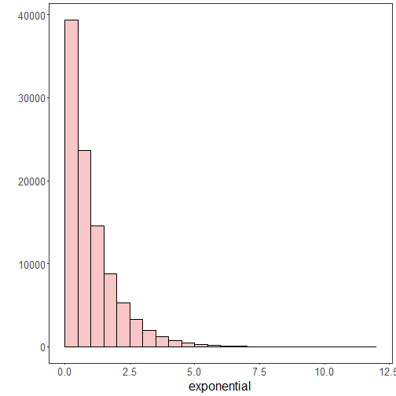
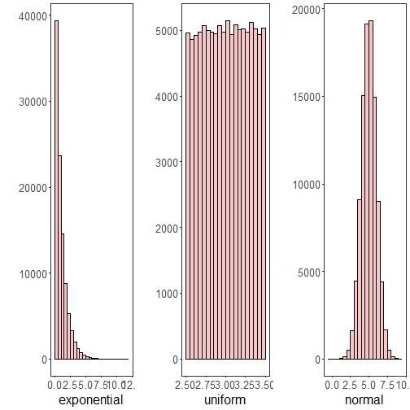

About the chart
- Histogram: distributes observations into bins along the x-axis; useful to visualize frequency and skewness.

Graphics environment setup.

``` r
# installation 
#install.packages("daltoolbox")

# loading DAL
library(daltoolbox) 
```


``` r
library(ggplot2)
library(RColorBrewer)

# color palette
colors <- brewer.pal(4, 'Set1')

# setting the font size for all charts
font <- theme(text = element_text(size=16))
```

Generate variables with distinct distributions (exponential, uniform, normal).

``` r
# Examples with data distributions
# We use random variables to facilitate visualization of different distributions.

# example: dataset to be plotted  
example <- data.frame(exponential = rexp(100000, rate = 1), 
                     uniform = runif(100000, min = 2.5, max = 3.5), 
                     normal = rnorm(100000, mean=5))
head(example)
```

```
##   exponential  uniform   normal
## 1  1.50202025 2.511495 6.166204
## 2  0.92555813 2.658274 5.450492
## 3  0.09460186 2.522169 5.995343
## 4  3.39222916 3.191661 4.710891
## 5  0.37036967 3.107975 4.664695
## 6  0.05203314 3.452856 6.306182
```

Histogram

Visualize the distribution of a continuous variable by binning the x-axis and counting observations per bin. `geom_histogram()` displays counts as bars.
More info: ?geom_histogram (R documentation)

Build histograms and arrange multiple charts side by side.

``` r
library(dplyr)

grf <- plot_hist(example |> dplyr::select(exponential), 
                  label_x = "exponential", color=colors[1]) + font
```

```
## Using  as id variables
```

``` r
options(repr.plot.width=5, repr.plot.height=4)
plot(grf)
```



Chart arrangement

Use `grid.arrange` to place the generated charts side by side.


``` r
grfe <- plot_hist(example |> dplyr::select(exponential), 
                  label_x = "exponential", color=colors[1]) + font
```

```
## Using  as id variables
```

``` r
grfu <- plot_hist(example |> dplyr::select(uniform), 
                  label_x = "uniform", color=colors[1]) + font  
```

```
## Using  as id variables
```

``` r
grfn <- plot_hist(example |> dplyr::select(normal), 
                  label_x = "normal", color=colors[1]) + font 
```

```
## Using  as id variables
```


``` r
library(gridExtra)  
```

```
## Warning: package 'gridExtra' was built under R version 4.5.1
```

```
## 
## Attaching package: 'gridExtra'
```

```
## The following object is masked from 'package:dplyr':
## 
##     combine
```

``` r
options(repr.plot.width=15, repr.plot.height=4)
grid.arrange(grfe, grfu, grfn, ncol=3)
```



References
- Freedman, D., and Diaconis, P. (1981). On the histogram as a density estimator: L2 theory. Zeitschrift für Wahrscheinlichkeitstheorie und verwandte Gebiete.
- Wickham, H. (2016). ggplot2: Elegant Graphics for Data Analysis. Springer.
