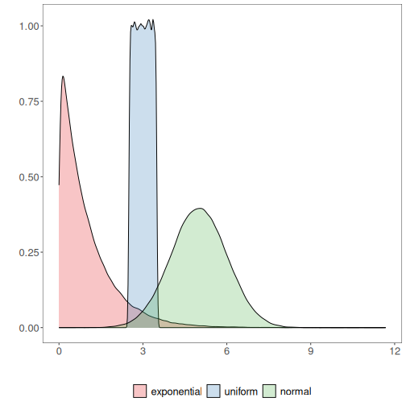
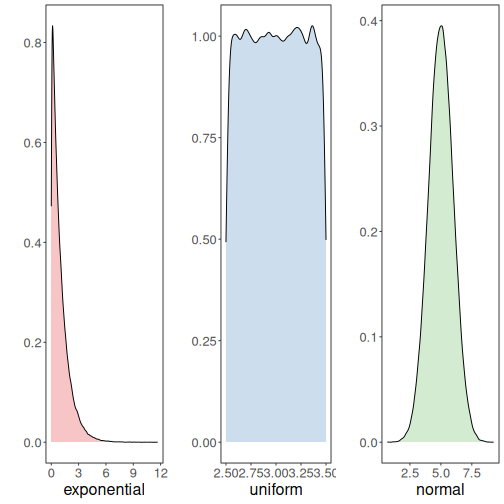

About the chart
- Density (kernel density): smoothed version of the histogram for continuous variables; highlights distribution shapes.

Graphics environment setup.

``` r
# installation 
#install.packages("daltoolbox")

# loading DAL
library(daltoolbox) 
```


``` r
library(RColorBrewer)
# color palette
colors <- brewer.pal(4, 'Set1')

library(ggplot2)
# setting the font size for all charts
font <- theme(text = element_text(size=16))
```

Examples with distinct distributions
The following use random variables to visualize different distributions.

Generate example variables with different distributions.

``` r
# example4: dataset to be plotted  
example <- data.frame(exponential = rexp(100000, rate = 1), 
                     uniform = runif(100000, min = 2.5, max = 3.5), 
                     normal = rnorm(100000, mean=5))
head(example)
```

```
##   exponential  uniform   normal
## 1   1.4637206 3.455148 4.630319
## 2   0.4663201 2.993767 3.326800
## 3   2.8007761 2.581836 7.493531
## 4   0.7207741 2.717562 2.930433
## 5   2.0369439 3.327043 4.585704
## 6   0.1001134 2.710376 4.702176
```

Density plot

Draws a kernel density estimate, a smoothed alternative to the histogram for continuous data.

More info: ?geom_density (R documentation)

Build densities and arrange individual charts in a grid.

``` r
options(repr.plot.width=8, repr.plot.height=5)
grf <- plot_density(example, colors=colors[1:3]) + font
```

```
## Using  as id variables
```

``` r
plot(grf)
```



Chart arrangement

The `grid.arrange` function can arrange multiple previously created charts.


``` r
library(dplyr)
grfe <- plot_density(example |> dplyr::select(exponential), 
                     label_x = "exponential", color=colors[1]) + font  
```

```
## Using  as id variables
```

``` r
grfu <- plot_density(example |> dplyr::select(uniform), 
                     label_x = "uniform", color=colors[2]) + font  
```

```
## Using  as id variables
```

``` r
grfn <- plot_density(example |> dplyr::select(normal), 
                     label_x = "normal", color=colors[3]) + font 
```

```
## Using  as id variables
```


``` r
library(gridExtra)  
options(repr.plot.width=15, repr.plot.height=4)
grid.arrange(grfe, grfu, grfn, ncol=3)
```



References
- Silverman, B. W. (1986). Density Estimation for Statistics and Data Analysis. Chapman and Hall.
- Wickham, H. (2016). ggplot2: Elegant Graphics for Data Analysis. Springer.
