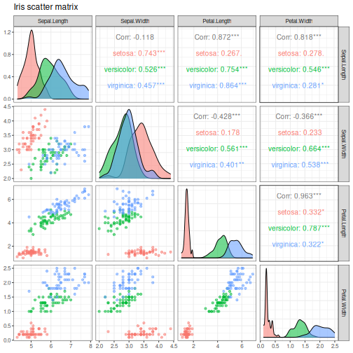

About the chart
- `plot_pair`: scatter-matrix view of several numeric variables.

Didactic goal: move from one pair of variables to a compact multivariate inspection. This kind of chart is useful for exploratory pattern reading before more formal modeling.


``` r
source(url("https://raw.githubusercontent.com/cefet-rj-dal/daltoolbox/main/examples/seed.R"))
# install.packages(c("daltoolbox", "GGally"))

library(daltoolbox)
library(GGally)
```


``` r
grf <- plot_pair(
  datasets::iris,
  cnames = colnames(datasets::iris)[1:4],
  title = "Iris scatter matrix",
  clabel = "Species"
)
print(grf)
```


