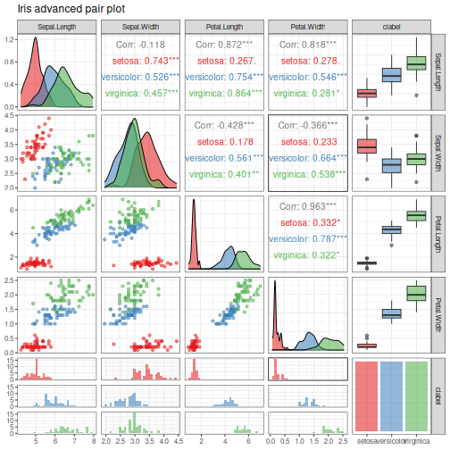

About the chart
- `plot_pair_adv`: advanced pair plot with manual class coloring.

Didactic goal: show a slightly richer multivariate inspection where the palette is controlled explicitly, which is useful for presentation-ready comparisons.


``` r
source(url("https://raw.githubusercontent.com/cefet-rj-dal/daltoolbox/main/examples/seed.R"))
# install.packages(c("daltoolbox", "GGally", "RColorBrewer"))

library(daltoolbox)
library(RColorBrewer)
```


``` r
if (requireNamespace("GGally", quietly = TRUE)) {
  colors <- brewer.pal(3, "Set1")
  grf <- plot_pair_adv(
    datasets::iris,
    cnames = colnames(datasets::iris)[1:4],
    title = "Iris advanced pair plot",
    clabel = "Species",
    colors = colors
  )
  print(grf)
}
```

```
## plot: [1, 1] [===>---------------------------------------------------------------------------------------------] 4% est: 0s
## plot: [1, 2] [=======>-----------------------------------------------------------------------------------------] 8% est: 1s
## plot: [1, 3] [===========>-------------------------------------------------------------------------------------] 12% est: 2s
## plot: [1, 4] [===============>---------------------------------------------------------------------------------] 16% est: 2s
## plot: [1, 5] [==================>------------------------------------------------------------------------------] 20% est: 2s
## plot: [2, 1] [======================>--------------------------------------------------------------------------] 24% est: 2s
## plot: [2, 2] [==========================>----------------------------------------------------------------------] 28% est: 2s
## plot: [2, 3] [==============================>------------------------------------------------------------------] 32% est: 2s
## plot: [2, 4] [==================================>--------------------------------------------------------------] 36% est: 2s
## plot: [2, 5] [======================================>----------------------------------------------------------] 40% est: 1s
## plot: [3, 1] [==========================================>------------------------------------------------------] 44% est: 1s
## plot: [3, 2] [==============================================>--------------------------------------------------] 48% est: 1s
## plot: [3, 3] [=================================================>-----------------------------------------------] 52% est: 1s
## plot: [3, 4] [=====================================================>-------------------------------------------] 56% est: 1s
## plot: [3, 5] [=========================================================>---------------------------------------] 60% est: 1s
## plot: [4, 1] [=============================================================>-----------------------------------] 64% est: 1s
## plot: [4, 2] [=================================================================>-------------------------------] 68% est: 1s
## plot: [4, 3] [=====================================================================>---------------------------] 72% est: 1s
## plot: [4, 4] [=========================================================================>-----------------------] 76% est: 1s
## plot: [4, 5] [=============================================================================>-------------------] 80% est: 1s
## plot: [5, 1] [================================================================================>----------------] 84% est: 0s
## `stat_bin()` using `bins = 30`. Pick better value `binwidth`.
 plot: [5, 2]
## [====================================================================================>------------] 88% est: 0s `stat_bin()`
## using `bins = 30`. Pick better value `binwidth`.
 plot: [5, 3]
## [========================================================================================>--------] 92% est: 0s `stat_bin()`
## using `bins = 30`. Pick better value `binwidth`.
 plot: [5, 4]
## [============================================================================================>----] 96% est: 0s `stat_bin()`
## using `bins = 30`. Pick better value `binwidth`.
 plot: [5, 5]
## [=================================================================================================]100% est: 0s
```


