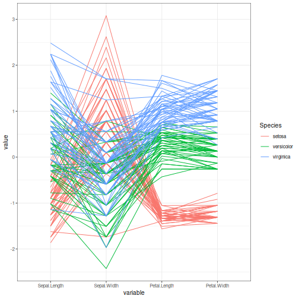

About the chart
- `plot_parallel`: parallel coordinates plot for multivariate comparison.

Didactic goal: present an alternative to scatter matrices when the reader wants to compare many numeric attributes simultaneously with class grouping.


``` r
source(url("https://raw.githubusercontent.com/cefet-rj-dal/daltoolbox/main/examples/seed.R"))
# install.packages(c("daltoolbox", "GGally"))

library(daltoolbox)
library(GGally)
```


``` r
grf <- plot_parallel(datasets::iris, columns = 1:4, group = 5)
plot(grf)
```


