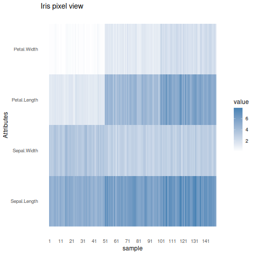

About the chart
- `plot_pixel`: pixel-oriented matrix visualization.

Didactic goal: show a dense multivariate view where rows and columns are read as a heatmap-like structure rather than as geometric points.


``` r
source(url("https://raw.githubusercontent.com/cefet-rj-dal/daltoolbox/main/examples/seed.R"))
# install.packages("daltoolbox")

library(daltoolbox)
```


``` r
grf <- plot_pixel(as.matrix(datasets::iris[, 1:4]), title = "Iris pixel view")
plot(grf)
```


