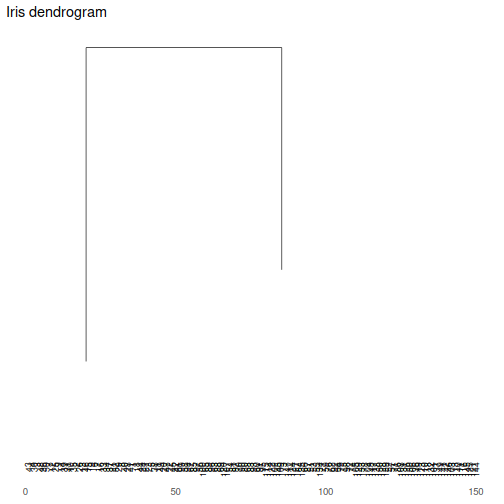

About the chart
- `plot_dendrogram`: dendrogram rendering for hierarchical clustering structures.

Didactic goal: give the reader a visual bridge between clustering and charting. A dendrogram is not just a plot of points; it is a plot of merge structure.


``` r
source(url("https://raw.githubusercontent.com/cefet-rj-dal/daltoolbox/main/examples/seed.R"))
# install.packages("daltoolbox")

library(daltoolbox)
```


``` r
options(repr.plot.width = 9, repr.plot.height = 4.5)
hc <- hclust(dist(scale(datasets::iris[, 1:4])), method = "ward.D2")
grf <- plot_dendrogram(hc, title = "Iris dendrogram")
plot(grf)
```


