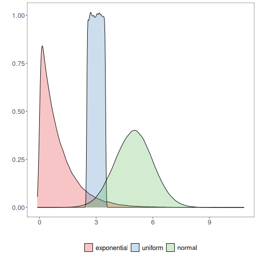
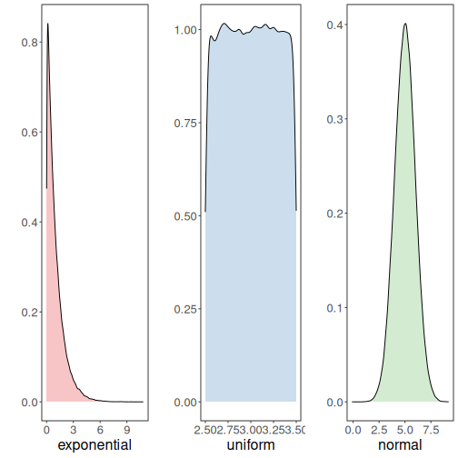

About the chart
- Density (kernel density): smoothed version of the histogram for continuous variables; highlights distribution shapes.

Graphics environment setup.

``` r
# installation 
#install.packages("daltoolbox")

# loading DAL
library(daltoolbox) 
```


``` r
library(RColorBrewer)
# color palette
colors <- brewer.pal(4, 'Set1')

library(ggplot2)
# setting the font size for all charts
font <- theme(text = element_text(size=16))
```

Examples with distinct distributions
The following use random variables to visualize different distributions.

Generate example variables with different distributions.

``` r
# example4: dataset to be plotted  
example <- data.frame(exponential = rexp(100000, rate = 1), 
                     uniform = runif(100000, min = 2.5, max = 3.5), 
                     normal = rnorm(100000, mean=5))
head(example)
```

```
##   exponential  uniform   normal
## 1  1.69082915 3.110778 3.509882
## 2  0.58784349 3.432669 5.146903
## 3  0.03356504 3.306626 3.916641
## 4  0.93216698 2.632631 6.592439
## 5  1.48961047 2.743151 5.796839
## 6  0.07589503 3.310770 5.389151
```

Density plot

Draws a kernel density estimate, a smoothed alternative to the histogram for continuous data.

More info: ?geom_density (R documentation)

Build densities and arrange individual charts in a grid.

``` r
options(repr.plot.width=8, repr.plot.height=5)
grf <- plot_density(example, colors=colors[1:3]) + font
```

```
## Using  as id variables
```

``` r
plot(grf)
```



Chart arrangement

The `grid.arrange` function can arrange multiple previously created charts.


``` r
library(dplyr)
grfe <- plot_density(example |> dplyr::select(exponential), 
                     label_x = "exponential", color=colors[1]) + font  
```

```
## Using  as id variables
```

``` r
grfu <- plot_density(example |> dplyr::select(uniform), 
                     label_x = "uniform", color=colors[2]) + font  
```

```
## Using  as id variables
```

``` r
grfn <- plot_density(example |> dplyr::select(normal), 
                     label_x = "normal", color=colors[3]) + font 
```

```
## Using  as id variables
```


``` r
library(gridExtra)  
```

```
## 
## Attaching package: 'gridExtra'
```

```
## The following object is masked from 'package:dplyr':
## 
##     combine
```

``` r
options(repr.plot.width=15, repr.plot.height=4)
grid.arrange(grfe, grfu, grfn, ncol=3)
```



References
- Silverman, B. W. (1986). Density Estimation for Statistics and Data Analysis. Chapman and Hall.
- Wickham, H. (2016). ggplot2: Elegant Graphics for Data Analysis. Springer.
