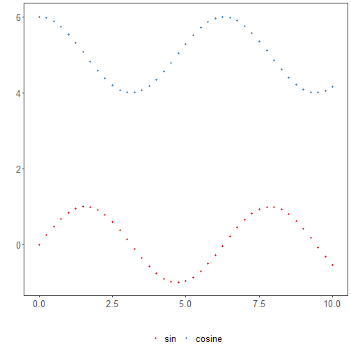

About the chart
- Points: similar to series, but without connecting lines; good to highlight discrete observations.

Graphics environment setup.

``` r
# installation 
#install.packages("daltoolbox")

# loading DAL
library(daltoolbox) 
```


``` r
library(ggplot2)
library(RColorBrewer)

# color palette
colors <- brewer.pal(4, 'Set1')

# setting the font size for all charts
font <- theme(text = element_text(size=16))
```

# Synthetic time series

Generate a synthetic series for the example and plot points only.

``` r
x <- seq(0, 10, 0.25)
serie <- data.frame(x, sin=sin(x), cosine=cos(x)+5)
head(serie)
```

```
##      x       sin   cosine
## 1 0.00 0.0000000 6.000000
## 2 0.25 0.2474040 5.968912
## 3 0.50 0.4794255 5.877583
## 4 0.75 0.6816388 5.731689
## 5 1.00 0.8414710 5.540302
## 6 1.25 0.9489846 5.315322
```


``` r
# Plot points

# A point plot is similiar to series plot without drawing lines.

# The function returns a preset graphic that can be enhanced. 
grf <- plot_points(serie, colors=colors[1:2])

# Increasing the font size of the graphics
grf <- grf + font

# Actual plot
plot(grf)
```



References
- Wickham, H. (2016). ggplot2: Elegant Graphics for Data Analysis. Springer.
