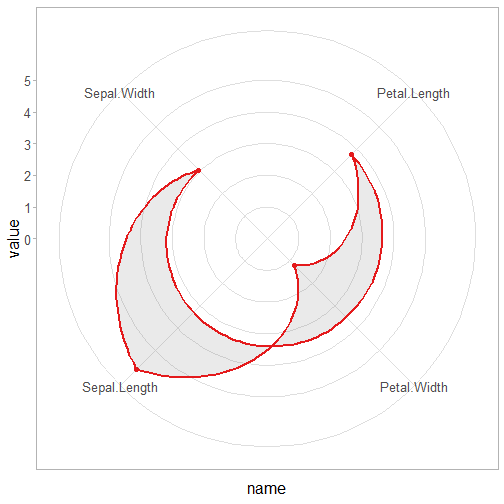

About the chart
- Radar: displays multiple numeric variables on radial axes from a common origin; useful for comparative profiles.

Graphics environment setup.

``` r
# installation 
#install.packages("daltoolbox")

# loading DAL
library(daltoolbox) 
```


``` r
library(ggplot2)
library(RColorBrewer)

# color palette
colors <- brewer.pal(4, 'Set1')

# setting the font size for all charts
font <- theme(text = element_text(size=16))
```

Mean per numeric variable and shaping the required format for radar.

``` r
# iris dataset for the example
head(iris)
```

```
##   Sepal.Length Sepal.Width Petal.Length Petal.Width Species
## 1          5.1         3.5          1.4         0.2  setosa
## 2          4.9         3.0          1.4         0.2  setosa
## 3          4.7         3.2          1.3         0.2  setosa
## 4          4.6         3.1          1.5         0.2  setosa
## 5          5.0         3.6          1.4         0.2  setosa
## 6          5.4         3.9          1.7         0.4  setosa
```


``` r
library(dplyr)

data <- iris |> dplyr::select(-Species) 
data <- sapply(data, mean)
data <- data.frame(name = names(data), value = data) |> dplyr::arrange(name)

head(data)
```

```
##                      name    value
## Petal.Length Petal.Length 3.758000
## Petal.Width   Petal.Width 1.199333
## Sepal.Length Sepal.Length 5.843333
## Sepal.Width   Sepal.Width 3.057333
```


``` r
# Radar chart

# Graphical method to display multivariate data with 3+ quantitative variables on axes starting from the same point.

# More info: https://en.wikipedia.org/wiki/Radar_chart

grf <- plot_radar(data, colors=colors[1]) + font
grf <- grf + ylim(0, NA)
plot(grf)
```



References
- Wickham, H. (2016). ggplot2: Elegant Graphics for Data Analysis. Springer.
- Wilkinson, L. (2005). The Grammar of Graphics (2nd ed.). Springer.
