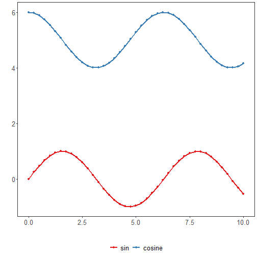

About the feature
- Chart saving: example of exporting with `jpeg()`/`dev.off()` and `ggsave()` to image files.

Graphics environment setup.

``` r
# installation 
#install.packages("daltoolbox")

# loading DAL
library(daltoolbox) 
```


``` r
library(ggplot2)
library(RColorBrewer)

# color palette
colors <- brewer.pal(4, 'Set1')

# setting the font size for all charts
font <- theme(text = element_text(size=16))
```

Synthetic series and chart to export.

``` r
# Synthetic time series

x <- seq(0, 10, 0.25)
serie <- data.frame(x, sin=sin(x), cosine=cos(x)+5)
head(serie)
```

```
##      x       sin   cosine
## 1 0.00 0.0000000 6.000000
## 2 0.25 0.2474040 5.968912
## 3 0.50 0.4794255 5.877583
## 4 0.75 0.6816388 5.731689
## 5 1.00 0.8414710 5.540302
## 6 1.25 0.9489846 5.315322
```


``` r
# Series chart

# Shows points connected by lines, with x-axis ordered by time/index.

# More info: https://en.wikipedia.org/wiki/Line_chart

grf <- plot_series(serie, colors=colors[1:2]) + font
plot(grf)
```



Export using base devices (JPEG) and with `ggsave`.

``` r
  jpeg("series.jpg", width = 640, height = 480)
  plot(grf)
  dev.off()
```

```
## png 
##   2
```


``` r
ggsave("series.png", width = 5, height = 4, units = "cm")
```

References
- Wickham, H. (2016). ggplot2: Elegant Graphics for Data Analysis. Springer. (ggsave)
