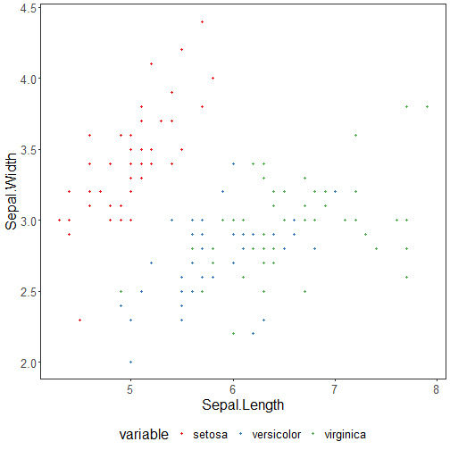

About the chart
- Scatter: assesses the relationship between two numeric variables, with optional coloring by group/category.

Graphics environment setup and color palette.

``` r
# installation 
#install.packages("daltoolbox")

# loading DAL
library(daltoolbox) 
```


``` r
library(ggplot2)
library(RColorBrewer)

# color palette
colors <- brewer.pal(4, 'Set1')

# setting the font size for all charts
font <- theme(text = element_text(size=16))
```

Sample data (iris) for the chart.

``` r
# conjunto de dados iris para o exemplo
head(iris)
```

```
##   Sepal.Length Sepal.Width Petal.Length Petal.Width Species
## 1          5.1         3.5          1.4         0.2  setosa
## 2          4.9         3.0          1.4         0.2  setosa
## 3          4.7         3.2          1.3         0.2  setosa
## 4          4.6         3.1          1.5         0.2  setosa
## 5          5.0         3.6          1.4         0.2  setosa
## 6          5.4         3.9          1.7         0.4  setosa
```

Build a scatter plot: select and rename columns to `x`, `value` (y), and `variable` (color).

``` r
# Scatter plot

# Used to visualize the relationship between two numeric variables.
# The first selected column is treated as X (independent) and the second as Y (dependent);
# a third categorical variable can color the points.

# The color vector must match the number of levels/groups.

# More info: https://en.wikipedia.org/wiki/Scatter_plot

library(dplyr)

grf <- plot_scatter(
  iris |> dplyr::select(x = Sepal.Length, value = Sepal.Width, variable = Species),
  label_x = "Sepal.Length",  # X-axis label
  label_y = "Sepal.Width",   # Y-axis label
  colors=colors[1:3]          # one color per Species level
) + font
plot(grf)
```


