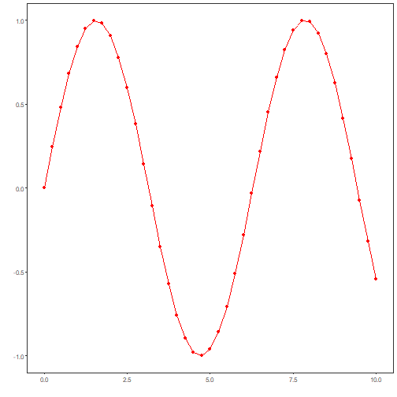

About the chart
- Simple time series: exploratory visualization of a temporal vector with ordered x-axis and y values.

Graphics environment setup.

``` r
# installation 
#install.packages("daltoolbox")

# loading DAL
library(daltoolbox) 
```


``` r
library(ggplot2)
library(RColorBrewer)

# color palette
colors <- brewer.pal(4, 'Set1')

# setting the font size for all charts
font <- theme(text = element_text(size=16))
```

Synthetic series (sine) for the example and plot with `plot_ts`.

``` r
# Synthetic time series

x <- seq(0, 10, 0.25)
y <- sin(x)
```


``` r
# Time series chart

# Basic exploratory visualization of a time series

grf <- plot_ts(x = x, y = y, color=c("red"))
plot(grf)
```



References
- Wickham, H. (2016). ggplot2: Elegant Graphics for Data Analysis. Springer.
- Hyndman, R. J., and Athanasopoulos, G. (2021). Forecasting: Principles and Practice (3rd ed.). OTexts.
