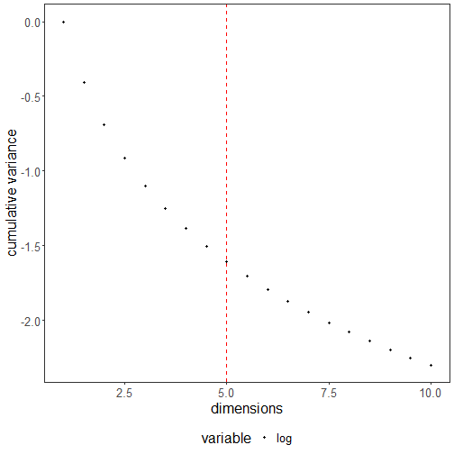
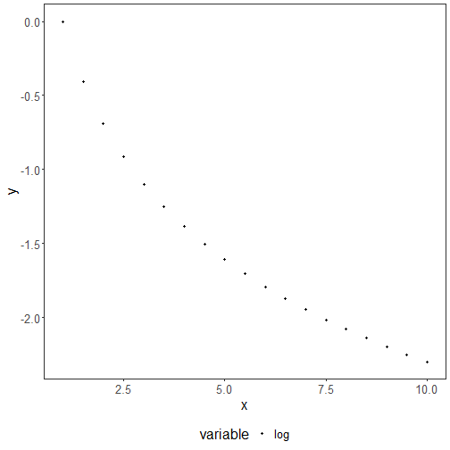
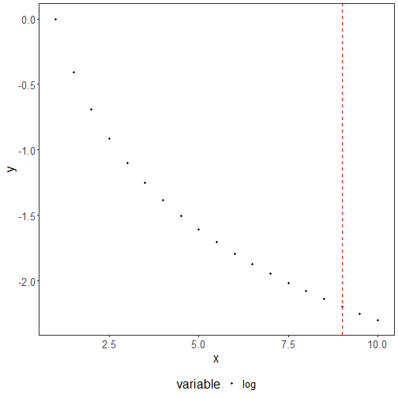

About the technique
- `fit_curvature_max`: computes curvature via the second derivative of a smoothed spline and returns the maximum curvature position for decreasing curves; useful to choose a trade-off point where further reductions add little benefit.


``` r
# installation 
#install.packages("daltoolbox")

# loading DAL
library(daltoolbox) 

# for ploting
library(ggplot2)
library(dplyr)
```


Synthetic example of a decreasing curve (-log) to illustrate the maximum curvature point.


``` r
# Maximum curvature
# If the curve is decreasing, use maximum curvature analysis. 
# It brings a trade-off between having lower x values (with not so low y values) and having higher x values (not having to much decrease in y values). 

x <- seq(from=1,to=10,by=0.5)
dat <- data.frame(x = x, value = -log(x), variable = as.factor("log"))
myfit <- fit_curvature_max()
res <- transform(myfit, dat$value)
head(res)
```

```
##   x         y         yfit
## 1 9 -1.609438 9.224359e-08
```


``` r
grf <- plot_scatter(dat, label_x = "dimensions", label_y = "cumulative variance", colors="black") + 
    theme(text = element_text(size=16))
plot(grf + geom_vline(xintercept = dat$x[res$x], linetype="dashed", color = "red", size=0.5))
```



About the technique
- `fit_curvature_max`: computes curvature via the second derivative of a smoothed spline over the sequence and returns the maximum curvature position (elbow) for decreasing or concave curves; useful to identify a knee where diminishing returns begin.

Environment setup.

``` r
# installation 
#install.packages("daltoolbox")

# loading DAL
library(daltoolbox) 

# for plotting
library(ggplot2)
library(dplyr)
```

Example curve and elbow detection.

``` r
x <- seq(from=1,to=10,by=0.5)
dat <- data.frame(x = x, value = -log(x), variable = "log")
dat$variable <- as.factor(dat$variable)
grf <- plot_scatter(dat, label_x = "x", label_y = "y", colors="black") + 
    theme(text = element_text(size=16))
plot(grf)
```



``` r
myfit <- fit_curvature_max()
res <- transform(myfit, dat$value)
res
```

```
##   x         y         yfit
## 1 9 -1.609438 9.224359e-08
```

``` r
plot(grf + geom_vline(xintercept = res$x, linetype="dashed", color = "red", size=0.5))
```



References
- Satopaa, V., Albrecht, J., Irwin, D., Raghavan, B. (2011). Finding a "Kneedle" in a Haystack: Detecting Knee Points in System Behavior.
