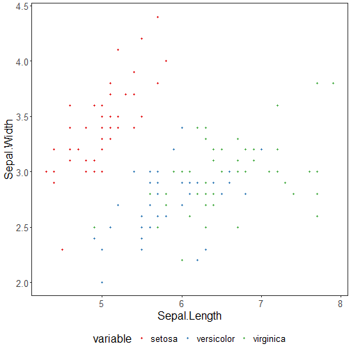

## Tutorial 12 - Visual Analysis and Reporting

A mining workflow should not end with a metric table. Visual inspection helps the analyst understand the data, spot separation or overlap among groups, and communicate the result in a clearer way.

This tutorial uses one exploratory plot and one compact reporting table as a bridge between analysis and communication.


``` r
# install.packages(c("daltoolbox", "ggplot2", "RColorBrewer", "dplyr"))

library(daltoolbox)
library(ggplot2)
```

```
## Warning: package 'ggplot2' was built under R version 4.5.2
```

``` r
library(RColorBrewer)
library(dplyr)
```

```
## Warning: package 'dplyr' was built under R version 4.5.2
```

```
## 
## Attaching package: 'dplyr'
```

```
## The following object is masked from 'package:MASS':
## 
##     select
```

```
## The following objects are masked from 'package:stats':
## 
##     filter, lag
```

```
## The following objects are masked from 'package:base':
## 
##     intersect, setdiff, setequal, union
```

Prepare a color palette and a shared theme so the plot is easier to read.

``` r
colors <- brewer.pal(4, "Set1")
font <- theme(text = element_text(size = 16))

iris <- datasets::iris
```

Create a scatter plot to inspect how two numeric attributes relate to the class structure. This kind of chart is often useful before choosing a classifier.

``` r
gr <- plot_scatter(
  iris |>
    dplyr::select(x = Sepal.Length, value = Sepal.Width, variable = Species),
  label_x = "Sepal.Length",
  label_y = "Sepal.Width",
  colors = colors[1:3]
) + font

plot(gr)
```



Now create a small comparison table that could appear in a report. The exact numbers are less important than the idea of communicating results in a compact and reproducible way.

``` r
set.seed(1)
sr <- train_test(sample_stratified("Species"), iris)
slevels <- levels(iris$Species)

models <- list(
  majority = cla_majority("Species", slevels),
  tree = cla_dtree("Species", slevels)
)

report <- lapply(names(models), function(name) {
  fitted <- fit(models[[name]], sr$train)
  pred <- predict(fitted, sr$test)
  metrics <- evaluate(fitted, adjust_class_label(sr$test$Species), pred)$metrics
  data.frame(model = name, t(metrics), check.names = FALSE)
})

do.call(rbind, report)
```

```
##                 model t(metrics)
## accuracy     majority  0.3333333
## TP           majority 10.0000000
## TN           majority  0.0000000
## FP           majority 20.0000000
## FN           majority  0.0000000
## precision    majority  0.3333333
## recall       majority  1.0000000
## sensitivity  majority  1.0000000
## specificity  majority  0.0000000
## f1           majority  0.5000000
## accuracy1        tree  0.9666667
## TP1              tree 10.0000000
## TN1              tree 20.0000000
## FP1              tree  0.0000000
## FN1              tree  0.0000000
## precision1       tree  1.0000000
## recall1          tree  1.0000000
## sensitivity1     tree  1.0000000
## specificity1     tree  1.0000000
## f11              tree  1.0000000
```

For teaching purposes, this tutorial shows that analysis and communication should be treated as part of the same workflow.
