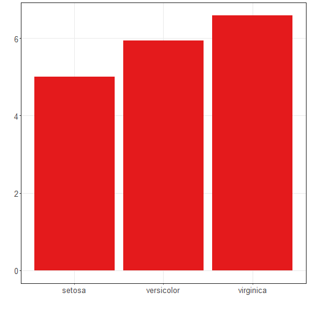

About the chart
- Bar: compares aggregated values by categories. Useful for means, counts, and totals by group.

Graphics environment setup and color palette.

``` r
# installation 
#install.packages("daltoolbox")

# loading DAL
library(daltoolbox) 
```


``` r
library(RColorBrewer)
library(ggplot2)
```

```
## Warning: package 'ggplot2' was built under R version 4.5.1
```

``` r
colors <- brewer.pal(4, 'Set1')

# setting the font size for all charts
font <- theme(text = element_text(size=16))
```

Sample data aggregated by `Species`.

``` r
# conjunto de dados iris para o exemplo
head(iris)
```

```
##   Sepal.Length Sepal.Width Petal.Length Petal.Width Species
## 1          5.1         3.5          1.4         0.2  setosa
## 2          4.9         3.0          1.4         0.2  setosa
## 3          4.7         3.2          1.3         0.2  setosa
## 4          4.6         3.1          1.5         0.2  setosa
## 5          5.0         3.6          1.4         0.2  setosa
## 6          5.4         3.9          1.7         0.4  setosa
```


``` r
library(dplyr)
```

```
## Warning: package 'dplyr' was built under R version 4.5.1
```

```
## 
## Attaching package: 'dplyr'
```

```
## The following objects are masked from 'package:stats':
## 
##     filter, lag
```

```
## The following objects are masked from 'package:base':
## 
##     intersect, setdiff, setequal, union
```

``` r
data <- iris |> group_by(Species) |> summarize(Sepal.Length=mean(Sepal.Length))
head(data)
```

```
## # A tibble: 3 × 2
##   Species    Sepal.Length
##   <fct>             <dbl>
## 1 setosa             5.01
## 2 versicolor         5.94
## 3 virginica          6.59
```

Basic bar chart and a vertical variant.

``` r
# Bar chart

# Displays categorical data with bars proportional to the aggregated value (count, mean, etc.).

# More info: https://en.wikipedia.org/wiki/Bar_chart

grf <- plot_bar(data, colors=colors[1]) + font
```

```
## Warning: `aes_string()` was deprecated in ggplot2 3.0.0.
## ℹ Please use tidy evaluation idioms with `aes()`.
## ℹ See also `vignette("ggplot2-in-packages")` for more information.
## ℹ The deprecated feature was likely used in the daltoolbox package.
##   Please report the issue at <https://github.com/cefet-rj-dal/daltoolbox/issues>.
## This warning is displayed once every 8 hours.
## Call `lifecycle::last_lifecycle_warnings()` to see where this warning was generated.
```

``` r
plot(grf)
```




``` r
# Bars can be flipped (horizontal/vertical) with coord_flip().
grf <- grf + coord_flip()
plot(grf)
```


Color each bar by species.

``` r
# Bar graph with one color for each species
grf <- plot_bar(data, colors=colors[1:3]) + font
plot(grf)
```


