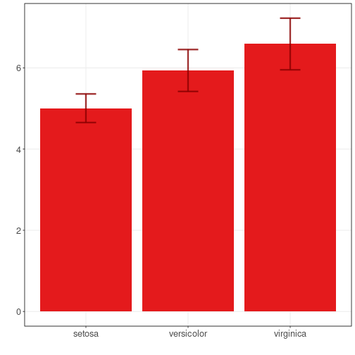

``` r
# installation 
install.packages("daltoolbox")

# loading DAL
library(daltoolbox) 
```


``` r
library(ggplot2)
library(RColorBrewer)

# color palette
colors <- brewer.pal(4, 'Set1')

# setting the font size for all charts
font <- theme(text = element_text(size=16))
```


``` r
# iris dataset for the example
head(iris)
```

```
##   Sepal.Length Sepal.Width Petal.Length Petal.Width Species
## 1          5.1         3.5          1.4         0.2  setosa
## 2          4.9         3.0          1.4         0.2  setosa
## 3          4.7         3.2          1.3         0.2  setosa
## 4          4.6         3.1          1.5         0.2  setosa
## 5          5.0         3.6          1.4         0.2  setosa
## 6          5.4         3.9          1.7         0.4  setosa
```


``` r
library(dplyr)
data <- iris |> group_by(Species) |> summarize(mean=mean(Sepal.Length), sd=sd(Sepal.Length))
head(data)
```

```
## # A tibble: 3 × 3
##   Species     mean    sd
##   <fct>      <dbl> <dbl>
## 1 setosa      5.01 0.352
## 2 versicolor  5.94 0.516
## 3 virginica   6.59 0.636
```


``` r
# Bar graph with error bars
# When bar graphs present an average behavior, it is possible to plot a dispersion around it using an error bar.
# The error bar is added using $geom\_errorbar()$ function to a previously defined bar graph. 

grf <- plot_bar(data, colors=colors[1], alpha=1) + font
grf <- grf + geom_errorbar(aes(x=Species, ymin=mean-sd, ymax=mean+sd), 
                           width=0.2, colour="darkred", alpha=0.8, size=1.1) 
plot(grf)
```



