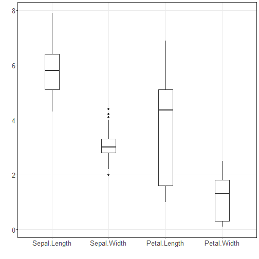

``` r
# DAL ToolBox
# version 1.2.707


#loading DAL
library(daltoolbox) 
```


``` r
library(ggplot2)
library(RColorBrewer)

#color palette
colors <- brewer.pal(4, 'Set1')

# setting the font size for all charts
font <- theme(text = element_text(size=16))
```


``` r
#iris dataset for the example
head(iris)
```

```
##   Sepal.Length Sepal.Width Petal.Length Petal.Width Species
## 1          5.1         3.5          1.4         0.2  setosa
## 2          4.9         3.0          1.4         0.2  setosa
## 3          4.7         3.2          1.3         0.2  setosa
## 4          4.6         3.1          1.5         0.2  setosa
## 5          5.0         3.6          1.4         0.2  setosa
## 6          5.4         3.9          1.7         0.4  setosa
```

## Box-plot
In descriptive statistics, a box plot is a method for graphically depicting groups of numerical data through their quartiles. Box plots may also have lines extending from the boxes (whiskers), indicating variability outside the upper and lower quartiles (outliers). 

More information: https://en.wikipedia.org/wiki/Box_plot


``` r
grf <- plot_boxplot(iris, colors="white") + font
```

```
## Using Species as id variables
```

``` r
plot(grf)  
```




``` r
grf <- plot_boxplot(iris, colors=colors[1:4]) + font
```

```
## Using Species as id variables
```

``` r
plot(grf)  
```


