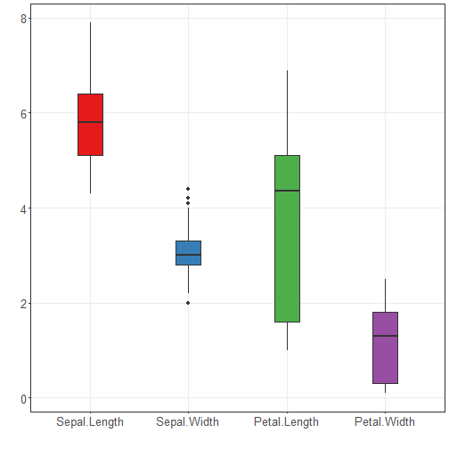

About the chart
- Boxplot: summarizes distribution via quartiles and highlights outliers; comparable across groups.

Graphics environment setup and palette.

``` r
# installation 
#install.packages("daltoolbox")

# loading DAL
library(daltoolbox) 
```


``` r
library(ggplot2)
library(RColorBrewer)

# color palette
colors <- brewer.pal(4, 'Set1')

# setting the font size for all charts
font <- theme(text = element_text(size=16))
```

Data and construction of a simple boxplot and a colored variant.

``` r
# conjunto de dados iris para o exemplo
head(iris)
```

```
##   Sepal.Length Sepal.Width Petal.Length Petal.Width Species
## 1          5.1         3.5          1.4         0.2  setosa
## 2          4.9         3.0          1.4         0.2  setosa
## 3          4.7         3.2          1.3         0.2  setosa
## 4          4.6         3.1          1.5         0.2  setosa
## 5          5.0         3.6          1.4         0.2  setosa
## 6          5.4         3.9          1.7         0.4  setosa
```


``` r
# Boxplot
# Represents distribution by quartiles; “whiskers” indicate variability outside the quartiles (and help identify outliers).

# More info: https://en.wikipedia.org/wiki/Box_plot

grf <- plot_boxplot(iris, colors="white") + font
```

```
## Using Species as id variables
```

``` r
plot(grf)  
```

```
## Ignoring unknown labels:
## • colour : "c(\"Sepal.Length\", \"Sepal.Width\", \"Petal.Length\", \"Petal.Width\", \"Species\")"
```


``` r
grf <- plot_boxplot(iris, colors=colors[1:4]) + font
```

```
## Using Species as id variables
```

``` r
plot(grf)  
```

```
## Ignoring unknown labels:
## • colour : "c(\"Sepal.Length\", \"Sepal.Width\", \"Petal.Length\", \"Petal.Width\", \"Species\")"
```


