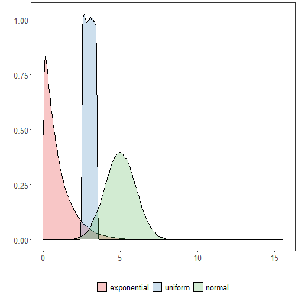
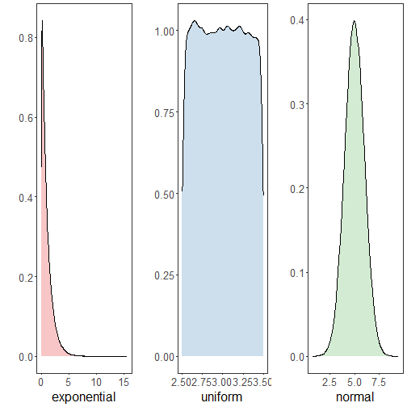

``` r
# installation 
install.packages("daltoolbox")
```

```

```

``` r
# loading DAL
library(daltoolbox) 
```


``` r
library(RColorBrewer)
# color palette
colors <- brewer.pal(4, 'Set1')

library(ggplot2)
# setting the font size for all charts
font <- theme(text = element_text(size=16))
```

# Examples using data distribution
The following examples use random variables so that different data distribution can be better viewed.


``` r
# example4: dataset to be plotted  
example <- data.frame(exponential = rexp(100000, rate = 1), 
                     uniform = runif(100000, min = 2.5, max = 3.5), 
                     normal = rnorm(100000, mean=5))
head(example)
```

```
##   exponential  uniform   normal
## 1   1.4552261 2.843158 5.298216
## 2   0.1788657 2.860798 5.059152
## 3   0.4232511 3.150330 4.329689
## 4   0.6887467 2.593078 5.647122
## 5   0.7012283 3.460120 4.891822
## 6   2.2377570 2.722793 5.408614
```

# Density plot

Computes and draws kernel density estimate, which is a smoothed version of the histogram. This is a useful alternative to the histogram for continuous data that comes from an underlying smooth distribution.

More information: ?geom_density (R documentation)


``` r
options(repr.plot.width=8, repr.plot.height=5)
grf <- plot_density(example, colors=colors[1:3]) + font
```

```
## Using  as id variables
```

``` r
plot(grf)
```



# Arrangement of graphs

Function $grid.arrange$ is used to position previously computed charts


``` r
library(dplyr)
grfe <- plot_density(example |> dplyr::select(exponential), 
                     label_x = "exponential", color=colors[1]) + font  
```

```
## Using  as id variables
```

``` r
grfu <- plot_density(example |> dplyr::select(uniform), 
                     label_x = "uniform", color=colors[2]) + font  
```

```
## Using  as id variables
```

``` r
grfn <- plot_density(example |> dplyr::select(normal), 
                     label_x = "normal", color=colors[3]) + font 
```

```
## Using  as id variables
```


``` r
library(gridExtra)  
options(repr.plot.width=15, repr.plot.height=4)
grid.arrange(grfe, grfu, grfn, ncol=3)
```



