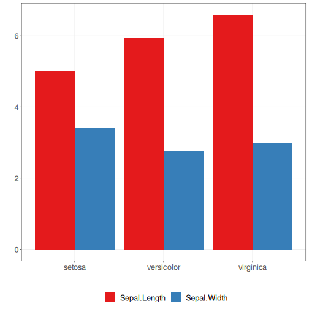

Sobre o gráfico
- Barras agrupadas: compara múltiplas medidas por categoria, exibindo barras lado a lado.

Preparação do ambiente gráfico.

``` r
# installation 
#install.packages("daltoolbox")

# loading DAL
library(daltoolbox) 
```


``` r
library(ggplot2)
library(RColorBrewer)

# color palette
colors <- brewer.pal(4, 'Set1')

# setting the font size for all charts
font <- theme(text = element_text(size=16))
```

Dados agregados por espécie para duas métricas.

``` r
# conjunto de dados iris para o exemplo
head(iris)
```

```
##   Sepal.Length Sepal.Width Petal.Length Petal.Width Species
## 1          5.1         3.5          1.4         0.2  setosa
## 2          4.9         3.0          1.4         0.2  setosa
## 3          4.7         3.2          1.3         0.2  setosa
## 4          4.6         3.1          1.5         0.2  setosa
## 5          5.0         3.6          1.4         0.2  setosa
## 6          5.4         3.9          1.7         0.4  setosa
```


``` r
library(dplyr)

data <- iris |> group_by(Species) |> summarize(Sepal.Length=mean(Sepal.Length), Sepal.Width=mean(Sepal.Width))
head(data)
```

```
## # A tibble: 3 × 3
##   Species    Sepal.Length Sepal.Width
##   <fct>             <dbl>       <dbl>
## 1 setosa             5.01        3.43
## 2 versicolor         5.94        2.77
## 3 virginica          6.59        2.97
```

Construindo gráfico de barras agrupadas.

``` r
# Barras agrupadas

# Organiza dados em grupos para cada categoria, exibindo duas ou mais barras por grupo, coloridas por medida.

# Mais informações: https://en.wikipedia.org/wiki/Bar_chart#Grouped_or_stacked

grf <- plot_groupedbar(data, colors=colors[1:2]) + font
plot(grf)
```


