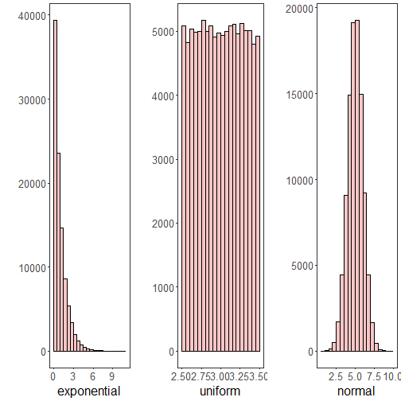

``` r
# installation 
install.packages"daltoolbox")

# loading DAL
library(daltoolbox) 
```


``` r
library(ggplot2)
library(RColorBrewer)

# color palette
colors <- brewer.pal(4, 'Set1')

# setting the font size for all charts
font <- theme(text = element_text(size=16))
```


``` r
# Examples using data distribution
# The following examples use random variables so that different data distribution can be better viewed.

# example: dataset to be plotted  
example <- data.frame(exponential = rexp(100000, rate = 1), 
                     uniform = runif(100000, min = 2.5, max = 3.5), 
                     normal = rnorm(100000, mean=5))
head(example)
```

```
##   exponential  uniform   normal
## 1 0.216138430 2.941200 5.505925
## 2 0.943980854 3.099802 5.148005
## 3 1.046171861 3.339772 3.979050
## 4 0.001249994 2.587751 4.121899
## 5 0.099194431 2.582568 4.403577
## 6 0.290940174 3.462437 5.358632
```

# Histogram

Visualize the distribution of a single continuous variable by dividing the x axis into bins and counting the number of observations in each bin. Histograms (geom_histogram()) display the counts with bars.
More information: ?geom_histogram (R documentation)


``` r
library(dplyr)

grf <- plot_hist(example |> dplyr::select(exponential), 
                  label_x = "exponential", color=colors[1]) + font
```

```
## Using  as id variables
```

``` r
options(repr.plot.width=5, repr.plot.height=4)
plot(grf)
```


# Arrangement of graphs

Function $grid.arrange$ is used to position previously computed charts


``` r
grfe <- plot_hist(example |> dplyr::select(exponential), 
                  label_x = "exponential", color=colors[1]) + font
```

```
## Using  as id variables
```

``` r
grfu <- plot_hist(example |> dplyr::select(uniform), 
                  label_x = "uniform", color=colors[1]) + font  
```

```
## Using  as id variables
```

``` r
grfn <- plot_hist(example |> dplyr::select(normal), 
                  label_x = "normal", color=colors[1]) + font 
```

```
## Using  as id variables
```


``` r
library(gridExtra)  

options(repr.plot.width=15, repr.plot.height=4)
grid.arrange(grfe, grfu, grfn, ncol=3)
```



