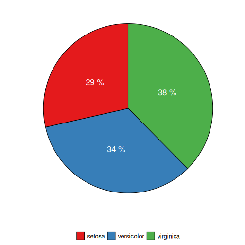

```r
# DAL ToolBox
# version 1.1.737


#loading DAL
library(daltoolbox) 
```


```r
library(ggplot2)
library(RColorBrewer)

#color palette
colors <- brewer.pal(4, 'Set1')

# setting the font size for all charts
font <- theme(text = element_text(size=16))
```


```r
#iris dataset for the example
head(iris)
```

```
##   Sepal.Length Sepal.Width Petal.Length Petal.Width Species
## 1          5.1         3.5          1.4         0.2  setosa
## 2          4.9         3.0          1.4         0.2  setosa
## 3          4.7         3.2          1.3         0.2  setosa
## 4          4.6         3.1          1.5         0.2  setosa
## 5          5.0         3.6          1.4         0.2  setosa
## 6          5.4         3.9          1.7         0.4  setosa
```


```r
library(dplyr)

data <- iris |> group_by(Species) |> summarize(Sepal.Length=mean(Sepal.Length))
head(data)
```

```
## # A tibble: 3 × 2
##   Species    Sepal.Length
##   <fct>             <dbl>
## 1 setosa             5.01
## 2 versicolor         5.94
## 3 virginica          6.59
```

## Pie chart
A pie chart is a circular statistical graphic, which is divided into slices to illustrate numerical proportion. 

More information: https://en.wikipedia.org/wiki/Pie_chart


```r
grf <- plot_pieplot(data, colors=colors[1:3]) + font
plot(grf)
```



