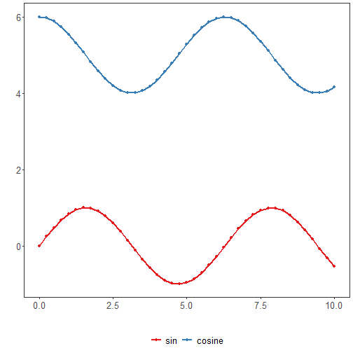

``` r
# installation 
install.packages("daltoobox")
```

```
## Installing package into '/home/gpca/R/x86_64-pc-linux-gnu-library/4.5'
## (as 'lib' is unspecified)
```

```
## Warning in install.packages :
##   package 'daltoobox' is not available for this version of R
## 
## A version of this package for your version of R might be available elsewhere,
## see the ideas at
## https://cran.r-project.org/doc/manuals/r-patched/R-admin.html#Installing-packages
```

``` r
# loading DAL
library(daltoolbox) 
```


``` r
library(ggplot2)
library(RColorBrewer)

# color palette
colors <- brewer.pal(4, 'Set1')

# setting the font size for all charts
font <- theme(text = element_text(size=16))
```


``` r
# Synthetic time series

x <- seq(0, 10, 0.25)
serie <- data.frame(x, sin=sin(x), cosine=cos(x)+5)
head(serie)
```

```
##      x       sin   cosine
## 1 0.00 0.0000000 6.000000
## 2 0.25 0.2474040 5.968912
## 3 0.50 0.4794255 5.877583
## 4 0.75 0.6816388 5.731689
## 5 1.00 0.8414710 5.540302
## 6 1.25 0.9489846 5.315322
```


``` r
# Series plot

# A series plot is a type of chart that displays information as a series of data points connected by straight line segments. 

# It is similar to a scatter plot except that their x-axis value orders the measurement points.

# More information: https://en.wikipedia.org/wiki/Line_chart

grf <- plot_series(serie, colors=colors[1:2]) + font
plot(grf)
```




``` r
ggsave("series.pdf", width = 5, height = 4, units = "cm")
```

