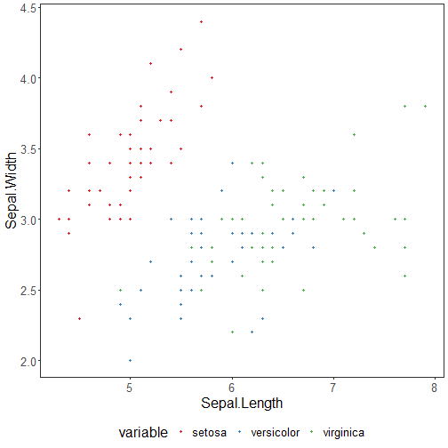

```r
# DAL ToolBox
# version 1.1.737


#loading DAL
library(daltoolbox) 
```


```r
library(ggplot2)
library(RColorBrewer)

#color palette
colors <- brewer.pal(4, 'Set1')

# setting the font size for all charts
font <- theme(text = element_text(size=16))
```


```r
#iris dataset for the example
head(iris)
```

```
##   Sepal.Length Sepal.Width Petal.Length Petal.Width Species
## 1          5.1         3.5          1.4         0.2  setosa
## 2          4.9         3.0          1.4         0.2  setosa
## 3          4.7         3.2          1.3         0.2  setosa
## 4          4.6         3.1          1.5         0.2  setosa
## 5          5.0         3.6          1.4         0.2  setosa
## 6          5.4         3.9          1.7         0.4  setosa
```

## Scatter plot

A Scatter plot is used to display values for the typical relationship between independent and dependent variables. The first column of the dataset is the independent variable, whereas the following variables are the dependent ones. 

The colors vectors should have the same size as the number of dependent columns. 

More information: https://en.wikipedia.org/wiki/Scatter_plot


```r
library(dplyr)

grf <- plot_scatter(iris |> dplyr::select(x = Sepal.Length, value = Sepal.Width, variable = Species), 
                    label_x = "Sepal.Length", label_y = "Sepal.Width", colors=colors[1:3]) + font
plot(grf)
```



