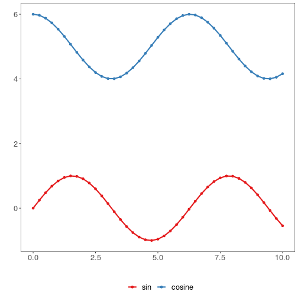

Sobre o gráfico
- Série temporal (linhas): pontos conectados por segmentos; destaca tendência e sazonalidade ao longo do tempo/eixo ordenado.

Preparação do ambiente gráfico.

``` r
# installation 
install.packages("daltoolbox")

# loading DAL
library(daltoolbox) 
```


``` r
library(ggplot2)
library(RColorBrewer)

# color palette
colors <- brewer.pal(4, 'Set1')

# setting the font size for all charts
font <- theme(text = element_text(size=16))
```

Série sintética (seno e cosseno deslocado) para exemplo.

``` r
# Série temporal sintética

x <- seq(0, 10, 0.25)
serie <- data.frame(x, sin=sin(x), cosine=cos(x)+5)
head(serie)
```

```
##      x       sin   cosine
## 1 0.00 0.0000000 6.000000
## 2 0.25 0.2474040 5.968912
## 3 0.50 0.4794255 5.877583
## 4 0.75 0.6816388 5.731689
## 5 1.00 0.8414710 5.540302
## 6 1.25 0.9489846 5.315322
```

Construindo gráfico de séries com duas linhas.

``` r
# Gráfico de séries

# Exibe uma sequência de pontos conectados por segmentos de reta. 

# Semelhante ao scatter, mas com eixo x ordenado por tempo/índice.

# Mais informações: https://en.wikipedia.org/wiki/Line_chart

grf <- plot_series(serie, colors=colors[1:2]) + font
plot(grf)
```


