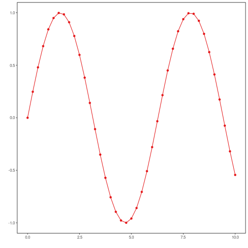

```r
# DAL ToolBox
# version 1.1.727


#loading DAL
library(daltoolbox) 
```


```r
library(ggplot2)
library(RColorBrewer)

#color palette
colors <- brewer.pal(4, 'Set1')

# setting the font size for all charts
font <- theme(text = element_text(size=16))
```

#### Synthetic time series


```r
x <- seq(0, 10, 0.25)
data <- data.frame(x, sin=sin(x))
head(data)
```

```
##      x       sin
## 1 0.00 0.0000000
## 2 0.25 0.2474040
## 3 0.50 0.4794255
## 4 0.75 0.6816388
## 5 1.00 0.8414710
## 6 1.25 0.9489846
```

## ts plot

A time series plot during exploratory analysis


```r
grf <- plot_ts(x = data$x, y = data$sin, color=colors[1])
plot(grf)
```



