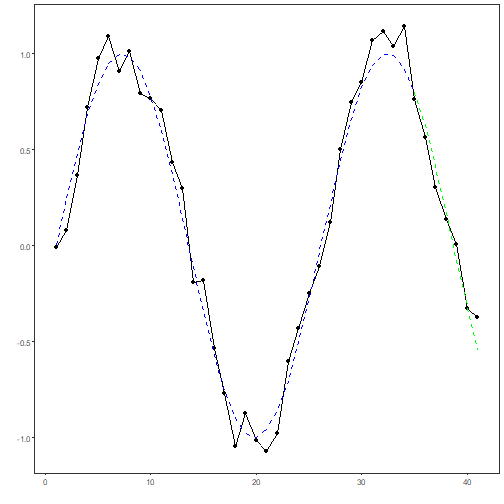

``` r
# installation 
install.packages("daltoobox")
```

```
## Installing package into '/home/gpca/R/x86_64-pc-linux-gnu-library/4.5'
## (as 'lib' is unspecified)
```

```
## Warning in install.packages :
##   package 'daltoobox' is not available for this version of R
## 
## A version of this package for your version of R might be available elsewhere,
## see the ideas at
## https://cran.r-project.org/doc/manuals/r-patched/R-admin.html#Installing-packages
```

``` r
# loading DAL
library(daltoolbox) 
```


``` r
library(ggplot2)
library(RColorBrewer)

# color palette
colors <- brewer.pal(4, 'Set1')

# setting the font size for all charts
font <- theme(text = element_text(size=16))
```


``` r
# Synthetic time series

i <- seq(0, 25, 0.25)
x <- cos(i)

ts <- ts_data(x, sw=0)
ts_head(ts, 3)
```

```
##             t0
## [1,] 1.0000000
## [2,] 0.9689124
## [3,] 0.8775826
```


``` r
# sampling training and test
samp <- ts_sample(ts, test_size= 5)

# division between input and output
io_train <- ts_projection(samp$train)
io_test <- ts_projection(samp$test)

# time series
yvalues <- c(io_train$output, io_test$output)

# model adjustment
model <- ts_arima()
model <- fit(model, x=io_train$input, y=io_train$output)
adjust <- predict(model, io_train$input)

# prediction
prediction <- predict(model, x=io_test$input, steps_ahead=5)
prediction <- as.vector(prediction)
```


``` r
# Series plot with predictions

# A time series ploting with model adjustment and prediction values. 

plot_ts_pred(y=yvalues, yadj=adjust, ypre=prediction)
```



