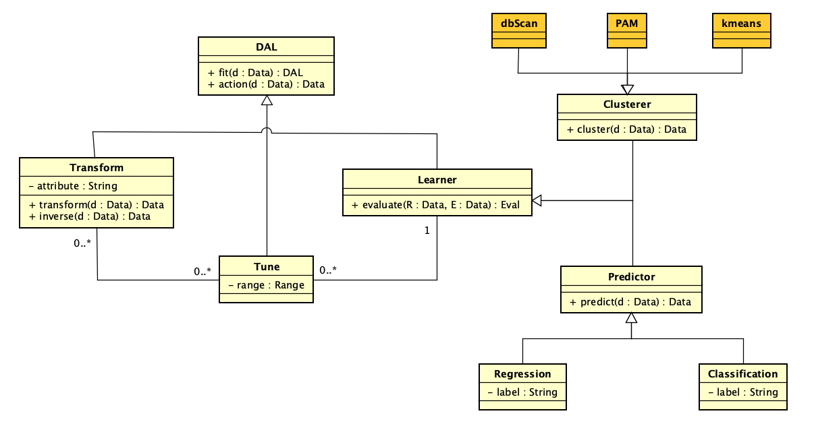

# Summary

The **daltoolbox** package provides an open-source framework for constructing modular and reproducible data analytics workflows in R. The toolbox operationalizes the concept of *Experiment Lines (EL)* [@Marinho2017], enabling the definition of experiment families through configurable combinations of preprocessing, modeling, and evaluation components. By explicitly modeling workflow variability and optionality, daltoolbox allows researchers and practitioners to systematically explore alternative analytical pipelines while maintaining a consistent execution structure. The package integrates seamlessly with existing R and Python libraries, promoting interoperability and transparency in experimental data analysis. This approach bridges concepts from software product line engineering and data analytics experimentation.

# Background

The rapid expansion of data-driven research across domains such as finance, healthcare, and environmental sciences has increased the demand for tools that support reproducibility, modularity, and experimental flexibility. In many studies, analysts must construct and compare multiple workflows that differ in preprocessing strategies, learning algorithms, or evaluation procedures. Managing this variability using traditional scripts often leads to duplicated code, fragile pipelines, and limited traceability of experimental decisions. Although scientific workflow systems have improved reproducibility and pipeline management, many of these systems emphasize fixed execution pipelines and provide limited support for systematically exploring alternative configurations during experimentation.

The concept of *Experiment Lines* (EL) [@Marinho2017], inspired by software product line engineering, addresses this limitation by introducing explicit modeling of **variability** (alternative components) and **optionality** (configurable presence or absence of steps). daltoolbox brings these principles into practical data analytics workflows, enabling structured experimentation while preserving reproducibility.

# Statement of Need

Data analytics workflows often require the systematic evaluation of multiple preprocessing techniques, learning algorithms, and evaluation strategies. Managing these alternatives frequently results in duplicated code, fragmented workflow definitions, and reduced traceability of experimental configurations, which ultimately hinders reproducibility.

The **daltoolbox** package addresses this problem by providing a unified interface for defining modular and configurable workflows. Through explicit modeling of workflow components, users can easily combine, replace, or omit transformations and learning algorithms while preserving a consistent experimental structure.

The primary audience includes researchers, educators, and data practitioners who need transparent and reproducible experimentation environments for tasks such as classification, regression, clustering, and time series prediction. By simplifying the exploration of analytical alternatives, daltoolbox enables systematic experimentation with minimal changes to the underlying workflow code.

# State of the Field

Several tools support the construction of machine learning workflows. Visual environments such as **WEKA** [@Witten2016], **Orange** [@Demsar2013], and **KNIME** [@Berthold2009] provide accessible interfaces for education and prototyping but offer limited flexibility for dynamic workflow reconfiguration. Frameworks such as **Scikit-learn** [@Pedregosa2011] and **MLlib** [@Meng2016] provide robust APIs for building pipelines, yet typically emphasize static pipeline compositions rather than explicit modeling of workflow variability.

Automated machine learning systems, including **Auto-WEKA** [@Kotthoff2017] and **Auto-sklearn** [@Feurer2015], automate model selection and hyperparameter optimization. While effective for performance optimization, these systems often reduce transparency and user control over experimental design.

In contrast, daltoolbox focuses on explicit modeling of variability and optionality within workflows. Rather than automating the analytical process, it provides a structured environment for transparent and reproducible experimentation, complementing existing machine learning frameworks.

# Software Design

The core class model is centered on the abstract `DAL` type, which defines the lifecycle methods `fit(d: Data): DAL` and `action(d: Data): Data`. As illustrated in Figure 1, this contract is specialized by the `Transform` and `Learner` abstractions, allowing preprocessing and learning components to be composed within a consistent execution framework. The `action` method represents the execution step and is implemented by derived components (e.g., `transform` in transformations and `predict` in predictors).



The `Transform` abstraction encapsulates data manipulation operations through `transform(d: Data): Data` and `inverse(d: Data): Data`. The `Learner` abstraction focuses on model assessment via `evaluate(R: Data, E: Data): Eval`. Hyperparameter exploration is represented by the `Tune` element (`range: Range`), which can be associated with both transformations and learners.

Prediction responsibilities are separated into the `Predictor` abstraction (`predict(d: Data): Data`), with `Regression` and `Classification` as concrete specializations. For unsupervised learning, the `Clusterer` abstraction extends `Learner` and includes algorithms such as `dbScan`, `PAM`, and `kmeans`.

This hierarchy makes workflow variability explicit at the software design level, enabling controlled substitution of components without requiring structural changes to experiment definitions.

# Main Features

daltoolbox provides a unified API that supports data transformation, classification, regression, and clustering tasks within a consistent workflow structure. The toolbox explicitly models optional and variable workflow components, enabling users to systematically explore alternative preprocessing strategies and learning algorithms. 

The framework includes modular operators for scaling, normalization, and dimensionality reduction, as well as utilities for visualization and model comparison. Its design allows easy substitution of preprocessing and modeling steps without requiring code refactoring. In addition, daltoolbox interoperates with external R and Python libraries and is distributed with comprehensive documentation and automated tests under the MIT license.

# Research Impact Statement

The **daltoolbox** supports studies that require systematic comparison of analytical pipeline alternatives. By making workflow variability explicit, the framework reduces code duplication and improves the traceability of experimental decisions.

In academic settings, the toolbox facilitates reproducible research and provides a transparent environment for teaching data analytics workflows. In applied contexts, it helps accelerate model development and evaluation cycles while maintaining transparency in analytical workflows.

As an open-source project, daltoolbox promotes collaboration across institutions and encourages the reuse and continuous evolution of analytical methods within the data science community.


# Example Usage

```r
# Define a tiny workflow runner once
DemoWorkflow <- function(model, prep, train, test) {
  prep  <- fit(prep, train)
  train <- transform(prep, train)
  model <- fit(model, train)
  predict(model, test)
}

# Scenario A: skip transformation (no-op) + KNN
prep_a  <- dal_transform()  # no-op transformer
model_a <- cla_knn("rain", levels = c("yes", "no"), k = 3)
preds_a <- DemoWorkflow(model_a, prep_a, train, test)

# Scenario B: min-max normalization + Random Forest
prep_b  <- minmax()
model_b <- cla_rf("rain", levels = c("yes", "no"))
preds_b <- DemoWorkflow(model_b, prep_b, train, test)
```

This pattern shows how a single workflow function enables testing alternative pipelines by switching only the `prep` or `model` component, without refactoring code.

# AI usage disclosure

Generative AI tools were used only for language support during manuscript drafting and editing, with emphasis on clarity and grammar. The technical content, methodological design, software implementation, experiments, and conclusions are the responsibility of the authors.

# Acknowledgements

This work was partially supported by **CNPq**, **CAPES**, and **FAPERJ**. The authors acknowledge the DAL community and institutional partners for their support.

# References

See `paper.bib` for the complete list of references.


