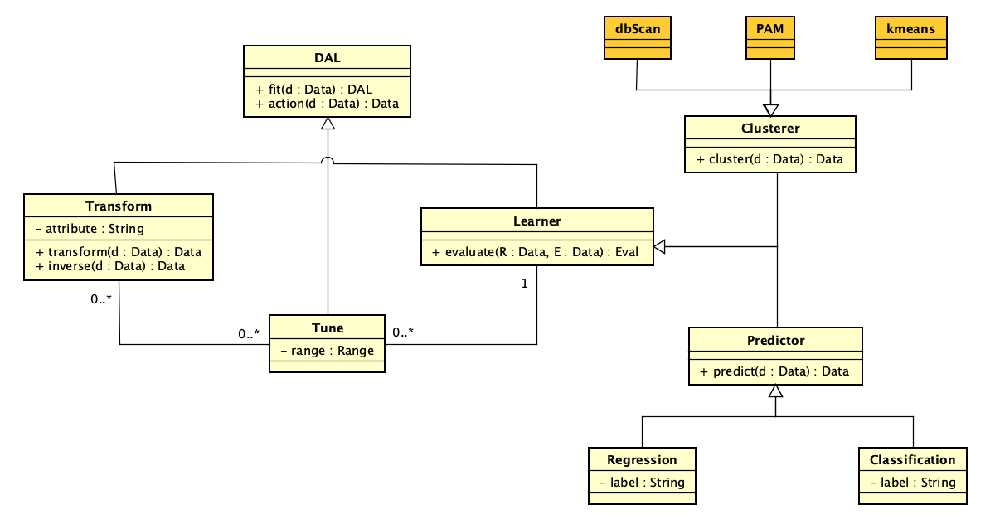

# Summary

The **daltoolbox** package provides an open-source framework for constructing modular and reproducible data analytics workflows in R. Built upon the concept of *Experiment Lines (EL)* [@Marinho2017], daltoolbox enables the definition of flexible experiment families through the composition of alternative preprocessing, modeling, and evaluation steps. This design allows researchers and practitioners to create, compare, and evolve analytical workflows with minimal code modification. The package integrates with external R and Python libraries, fostering interoperability and transparency in experimental data analysis.

# Background

The rapid expansion of data-driven research across domains such as finance, healthcare, and environmental sciences has increased the need for tools that support reproducibility, modularity, and flexibility in data analytics. Researchers often need to construct and compare multiple workflows, each differing in transformation methods, learning algorithms, or evaluation criteria. However, managing this variability is time-consuming and error-prone when using traditional scripting or static pipeline tools. Scientific workflow systems have advanced reproducibility but often lack the flexibility required for experimentation.

The concept of *Experiment Lines* (EL) [@Marinho2017], derived from software product line engineering, extends workflow design by introducing **variability** (alternative components) and **optionality** (configurable presence or absence of steps). daltoolbox operationalizes EL principles for data analytics, providing a practical, code-based framework for managing experimental diversity.

# Statement of Need

Data analytics workflows frequently require the exploration of multiple preprocessing, modeling, and evaluation alternatives. Managing these alternatives often leads to repetitive code, fragmented design, and limited traceability, which hinder reproducibility across experiments. daltoolbox was developed to address this challenge by enabling modular and flexible experiment definition through a unified interface. 

The **target audience** includes researchers, educators, and data practitioners who require transparent, reproducible workflows for experimentation in classification, regression, clustering, and time series prediction. The package is particularly valuable in academic and applied research contexts, where multiple analytical alternatives must be compared under controlled conditions.

daltoolbox provides a consistent syntax and modular architecture that facilitate systematic experimentation. Users can easily modify, replace, or omit workflow components, allowing efficient exploration of design alternatives while preserving reproducibility and transparency.

# State of the Field

Several tools exist for designing machine learning workflows. Visual environments such as **WEKA** [@Witten2016], **Orange** [@Demsar2013], and **KNIME** [@Berthold2009] are widely used for education and prototyping but offer limited flexibility for dynamic reconfiguration. Frameworks such as **Scikit-learn** [@Pedregosa2011] and **MLlib** [@Meng2016] provide robust APIs but focus on static pipelines rather than structured workflow variability. AutoML systems like **Auto-WEKA** [@Kotthoff2017] and **Auto-sklearn** [@Feurer2015] automate model selection but reduce user control and transparency.

daltoolbox differentiates itself by offering explicit modeling of variability and optionality, allowing controlled exploration of alternatives. This focus on transparency and user-driven design complements rather than replaces existing ML frameworks, positioning daltoolbox as an intermediary layer for reproducible experimentation.

# Software Design

The class model is centered on the abstract `DAL` type, which defines the core lifecycle methods `fit(d: Data): DAL` and `action(d: Data): Data`. As shown in Figure 1, this base contract is specialized by `Transform` and `Learner`, ensuring that preprocessing and learning components can be composed under a shared interface while preserving a consistent execution flow.



`Transform` encapsulates data manipulation operations through `transform(d: Data): Data` and `inverse(d: Data): Data`, while `Learner` focuses on model assessment via `evaluate(R: Data, E: Data): Eval`. The `Tune` element (`range: Range`) models hyperparameter exploration and is associated with both `Transform` and `Learner` using `0..*` multiplicities, representing that multiple tuning configurations can be attached to transformation and learning stages, and that these configurations can be optional.

Prediction concerns are isolated in the `Predictor` abstraction (`predict(d: Data): Data`), with `Regression` and `Classification` as concrete specializations. For unsupervised analysis, `Clusterer` extends `Learner` and is further specialized by algorithms such as `dbScan`, `PAM`, and `kmeans`, exposing `cluster(d: Data): Data`. This hierarchy makes variability explicit in the software design, allowing controlled substitution of components without structural changes to experiment definitions.

# Main Features

- Unified API for **transformation**, **classification**, **regression**, and **clustering**.
- Explicit modeling of *optional* and *variable* workflow components.
- Modular operators for scaling, normalization, and dimensionality reduction.
- Easy substitution of models and preprocessing steps without code refactoring.
- Visualization utilities for model comparison and interpretation.
- Interoperability with external R and Python libraries.
- Comprehensive documentation and testing, distributed under the MIT license.

# Research Impact Statement

The **daltoolbox** contributes to studies that rely on systematic comparison of pipeline alternatives, especially when many transformation, algorithm, and evaluation choices must be explored. By making these variations explicit in workflow design, the package reduces rework and improves traceability of experimental decisions.

In academia, the toolbox supports both teaching and applied research by providing a clear basis for replication. In practical settings, it helps shorten model development and validation cycles while improving transparency in analytical processes.

As open-source software, **daltoolbox** also encourages collaboration across groups and institutions, increasing method reuse and enabling continuous community-driven evolution.


# Example Usage

```r
# Define a tiny workflow runner once
DemoWorkflow <- function(model, prep, train, test) {
  prep  <- fit(prep, train)
  train <- transform(prep, train)
  model <- fit(model, train)
  predict(model, test)
}

# Scenario A: skip transformation (no-op) + KNN
prep_a  <- dal_transform()  # no-op transformer
model_a <- cla_knn("rain", levels = c("yes", "no"), k = 3)
preds_a <- DemoWorkflow(model_a, prep_a, train, test)

# Scenario B: min-max normalization + Random Forest
prep_b  <- minmax()
model_b <- cla_rf("rain", levels = c("yes", "no"))
preds_b <- DemoWorkflow(model_b, prep_b, train, test)
```

This pattern shows how a single workflow function enables testing alternative pipelines by switching only the `prep` or `model` component, without refactoring code.

# AI usage disclosure

Generative AI tools were used only for language support during manuscript drafting and editing, with emphasis on clarity and grammar. The technical content, methodological design, software implementation, experiments, and conclusions are the responsibility of the authors.

# Acknowledgements

This work was partially supported by **CNPq**, **CAPES**, and **FAPERJ**. The authors acknowledge the DAL community and institutional partners for their support.

# References

See `paper.bib` for the complete list of references.


