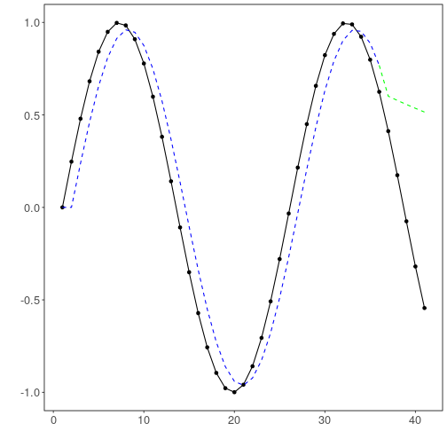

## Time Series Regression - arima


``` r
# DAL ToolBox
# version 1.2.707


#loading DAL
library(daltoolbox) 
```

### Series for studying


``` r
data(sin_data)
ts <- ts_data(sin_data$y, 0)
ts_head(ts, 3)
```

```
##             t0
## [1,] 0.0000000
## [2,] 0.2474040
## [3,] 0.4794255
```


``` r
library(ggplot2)
plot_ts(x=sin_data$x, y=sin_data$y) + theme(text = element_text(size=16))
```


### data sampling


``` r
samp <- ts_sample(ts, test_size = 5)
io_train <- ts_projection(samp$train)
io_test <- ts_projection(samp$test)
```

### Model training


``` r
model <- ts_arima()
model <- fit(model, x=io_train$input, y=io_train$output)
```

### Evaluation of adjustment


``` r
adjust <- predict(model, io_train$input)
adjust <- as.vector(adjust)
output <- as.vector(io_train$output)
ev_adjust <- evaluate(model, output, adjust)
ev_adjust$mse
```

```
## [1] 0.02857686
```

### Prediction of test


``` r
prediction <- predict(model, x=io_test$input[1,], steps_ahead=5)
prediction <- as.vector(prediction)
output <- as.vector(io_test$output)
ev_test <- evaluate(model, output, prediction)
ev_test
```

```
## $values
## [1]  0.41211849  0.17388949 -0.07515112 -0.31951919 -0.54402111
## 
## $prediction
## [1] 0.6011374 0.5784414 0.5566023 0.5355877 0.5153665
## 
## $smape
## [1] 1.489711
## 
## $mse
## [1] 0.4904025
## 
## $R2
## [1] -3.235632
## 
## $metrics
##         mse    smape        R2
## 1 0.4904025 1.489711 -3.235632
```

### Plot results


``` r
yvalues <- c(io_train$output, io_test$output)
plot_ts_pred(y=yvalues, yadj=adjust, ypre=prediction) + theme(text = element_text(size=16))
```



