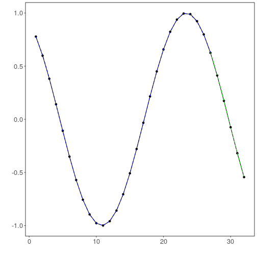

## Time Series regression - 1D Convolutional Neural Networks (Conv1D)


```r
# DAL ToolBox
# version 1.1.727


#loading DAL
library(daltoolbox)
```

### Series for studying


```r
data(sin_data)
ts <- ts_data(sin_data$y, 10)
ts_head(ts, 3)
```

```
##             t9        t8        t7        t6        t5        t4        t3        t2        t1        t0
## [1,] 0.0000000 0.2474040 0.4794255 0.6816388 0.8414710 0.9489846 0.9974950 0.9839859 0.9092974 0.7780732
## [2,] 0.2474040 0.4794255 0.6816388 0.8414710 0.9489846 0.9974950 0.9839859 0.9092974 0.7780732 0.5984721
## [3,] 0.4794255 0.6816388 0.8414710 0.9489846 0.9974950 0.9839859 0.9092974 0.7780732 0.5984721 0.3816610
```


```r
library(ggplot2)
plot_ts(x=sin_data$x, y=sin_data$y) + theme(text = element_text(size=16))
```


### data sampling


```r
samp <- ts_sample(ts, test_size = 5)
io_train <- ts_projection(samp$train)
io_test <- ts_projection(samp$test)
```

### Model training


```r
model <- ts_conv1d(ts_norm_gminmax(), input_size=4, epochs=10000)
model <- fit(model, x=io_train$input, y=io_train$output)
```

### Evaluation of adjustment


```r
adjust <- predict(model, io_train$input)
adjust <- as.vector(adjust)
output <- as.vector(io_train$output)
ev_adjust <- evaluate(model, output, adjust)
ev_adjust$mse
```

```
## [1] 2.649499e-06
```

### Prediction of test


```r
prediction <- predict(model, x=io_test$input[1,], steps_ahead=5)
prediction <- as.vector(prediction)
output <- as.vector(io_test$output)
ev_test <- evaluate(model, output, prediction)
ev_test
```

```
## $values
## [1]  0.41211849  0.17388949 -0.07515112 -0.31951919 -0.54402111
## 
## $prediction
## [1]  0.4105956  0.1711172 -0.0787387 -0.3223954 -0.5475302
## 
## $smape
## [1] 0.01635785
## 
## $mse
## [1] 8.692349e-06
## 
## $R2
## [1] 0.9999249
## 
## $metrics
##            mse      smape        R2
## 1 8.692349e-06 0.01635785 0.9999249
```

### Plot results


```r
yvalues <- c(io_train$output, io_test$output)
plot_ts_pred(y=yvalues, yadj=adjust, ypre=prediction) + theme(text = element_text(size=16))
```



