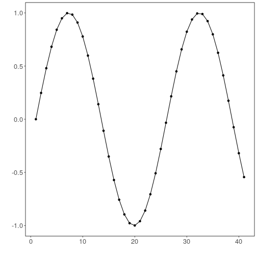

``` r
# DAL ToolBox
# version 1.1.737


#loading DAL
library(daltoolbox) 
```


``` r
data(sin_data)
x <- sin_data$x
y <- sin_data$y
```


``` r
library(ggplot2)
plot_ts(x=x, y=y) + theme(text = element_text(size=16))
```


``` r
data <- ts_data(y)
ts_head(data)
```

```
##             t0
## [1,] 0.0000000
## [2,] 0.2474040
## [3,] 0.4794255
## [4,] 0.6816388
## [5,] 0.8414710
## [6,] 0.9489846
```

``` r
plot_ts(y=data[,1]) + theme(text = element_text(size=16))
```




``` r
data10 <- ts_data(y, 10)
ts_head(data10)
```

```
##             t9        t8        t7        t6        t5        t4        t3        t2         t1         t0
## [1,] 0.0000000 0.2474040 0.4794255 0.6816388 0.8414710 0.9489846 0.9974950 0.9839859  0.9092974  0.7780732
## [2,] 0.2474040 0.4794255 0.6816388 0.8414710 0.9489846 0.9974950 0.9839859 0.9092974  0.7780732  0.5984721
## [3,] 0.4794255 0.6816388 0.8414710 0.9489846 0.9974950 0.9839859 0.9092974 0.7780732  0.5984721  0.3816610
## [4,] 0.6816388 0.8414710 0.9489846 0.9974950 0.9839859 0.9092974 0.7780732 0.5984721  0.3816610  0.1411200
## [5,] 0.8414710 0.9489846 0.9974950 0.9839859 0.9092974 0.7780732 0.5984721 0.3816610  0.1411200 -0.1081951
## [6,] 0.9489846 0.9974950 0.9839859 0.9092974 0.7780732 0.5984721 0.3816610 0.1411200 -0.1081951 -0.3507832
```


``` r
r1 <- data10[12,]
r1
```

```
##            t9      t8         t7         t6         t5         t4         t3         t2         t1         t0
## [1,] 0.381661 0.14112 -0.1081951 -0.3507832 -0.5715613 -0.7568025 -0.8949894 -0.9775301 -0.9992928 -0.9589243
## attr(,"class")
## [1] "ts_data" "matrix"  "array"  
## attr(,"sw")
## [1] 10
```


``` r
r2 <- data10[12:13,]
r2
```

```
##            t9         t8         t7         t6         t5         t4         t3         t2         t1         t0
## [1,] 0.381661  0.1411200 -0.1081951 -0.3507832 -0.5715613 -0.7568025 -0.8949894 -0.9775301 -0.9992928 -0.9589243
## [2,] 0.141120 -0.1081951 -0.3507832 -0.5715613 -0.7568025 -0.8949894 -0.9775301 -0.9992928 -0.9589243 -0.8589345
## attr(,"class")
## [1] "ts_data" "matrix"  "array"  
## attr(,"sw")
## [1] 10
```


``` r
c1 <- data10[,1]
ts_head(c1)
```

```
##             t9
## [1,] 0.0000000
## [2,] 0.2474040
## [3,] 0.4794255
## [4,] 0.6816388
## [5,] 0.8414710
## [6,] 0.9489846
```


``` r
c2 <- data10[,1:2]
ts_head(c2)
```

```
##             t9        t8
## [1,] 0.0000000 0.2474040
## [2,] 0.2474040 0.4794255
## [3,] 0.4794255 0.6816388
## [4,] 0.6816388 0.8414710
## [5,] 0.8414710 0.9489846
## [6,] 0.9489846 0.9974950
```


``` r
rc1 <- data10[12:13,1:2]
rc1
```

```
##            t9         t8
## [1,] 0.381661  0.1411200
## [2,] 0.141120 -0.1081951
## attr(,"class")
## [1] "ts_data" "matrix"  "array"  
## attr(,"sw")
## [1] 2
```


``` r
rc2 <- data10[12,1:2]
rc2
```

```
##            t9      t8
## [1,] 0.381661 0.14112
## attr(,"class")
## [1] "ts_data" "matrix"  "array"  
## attr(,"sw")
## [1] 2
```


``` r
rc3 <- data10[12:13,1]
rc3
```

```
##            t9
## [1,] 0.381661
## [2,] 0.141120
## attr(,"class")
## [1] "ts_data" "matrix"  "array"  
## attr(,"sw")
## [1] 1
```


``` r
rc4 <- data10[12,1]
rc4
```

```
##            t9
## [1,] 0.381661
## attr(,"class")
## [1] "ts_data" "matrix"  "array"  
## attr(,"sw")
## [1] 1
```

