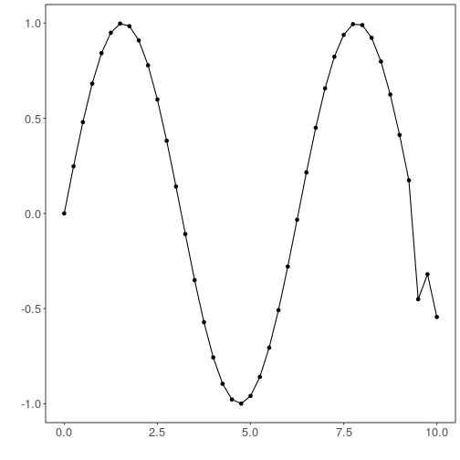

## Time Series Encoder-Decoder


```r
# DAL ToolBox
# version 1.1.737


#loading DAL
library(daltoolbox)
```

### Series for studying


```r
data(sin_data)
sin_data$y[39] <- sin_data$y[39]*6
```


```r
sw_size <- 5
ts <- ts_data(sin_data$y, sw_size)
ts_head(ts, 3)
```

```
##             t4        t3        t2        t1        t0
## [1,] 0.0000000 0.2474040 0.4794255 0.6816388 0.8414710
## [2,] 0.2474040 0.4794255 0.6816388 0.8414710 0.9489846
## [3,] 0.4794255 0.6816388 0.8414710 0.9489846 0.9974950
```


```r
library(ggplot2)
plot_ts(x=sin_data$x, y=sin_data$y) + theme(text = element_text(size=16))
```



### data sampling


```r
samp <- ts_sample(ts, test_size = 5)
train <- as.data.frame(samp$train)
test <- as.data.frame(samp$test)
```

### Model training


```r
auto <- autoenc_ed(5, 3)
auto <- fit(auto, train)
```

### Evaluation of encoding


```r
print(head(train))
```

```
##          t4        t3        t2        t1        t0
## 1 0.0000000 0.2474040 0.4794255 0.6816388 0.8414710
## 2 0.2474040 0.4794255 0.6816388 0.8414710 0.9489846
## 3 0.4794255 0.6816388 0.8414710 0.9489846 0.9974950
## 4 0.6816388 0.8414710 0.9489846 0.9974950 0.9839859
## 5 0.8414710 0.9489846 0.9974950 0.9839859 0.9092974
## 6 0.9489846 0.9974950 0.9839859 0.9092974 0.7780732
```

```r
result <- transform(auto, train)
print(head(result))
```

```
##              [,1]      [,2]      [,3]      [,4]      [,5]
## [1,] -0.002115838 0.2499366 0.4793098 0.6827410 0.8436527
## [2,]  0.242580920 0.4851755 0.6889939 0.8448228 0.9463704
## [3,]  0.475554705 0.6809413 0.8424568 0.9470596 1.0014166
## [4,]  0.681948662 0.8359511 0.9473424 0.9971562 0.9869981
## [5,]  0.845611751 0.9462277 0.9941676 0.9824111 0.9069355
## [6,]  0.944791317 0.9993761 0.9834120 0.9108146 0.7774704
```

### Encoding of test


```r
print(head(test))
```

```
##          t4        t3         t2         t1         t0
## 1 0.9893582 0.9226042  0.7984871  0.6247240  0.4121185
## 2 0.9226042 0.7984871  0.6247240  0.4121185  0.1738895
## 3 0.7984871 0.6247240  0.4121185  0.1738895 -0.4509067
## 4 0.6247240 0.4121185  0.1738895 -0.4509067 -0.3195192
## 5 0.4121185 0.1738895 -0.4509067 -0.3195192 -0.5440211
```

```r
result <- transform(auto, test)
print(head(result))
```

```
##           [,1]      [,2]       [,3]       [,4]       [,5]
## [1,] 0.9915379 0.9229855  0.8024844  0.6259958  0.4135459
## [2,] 0.9204364 0.7970192  0.6303546  0.4137512  0.1796162
## [3,] 0.9122333 0.6818532  0.3451913 -0.0493895 -0.2124786
## [4,] 0.6010433 0.3632708  0.1028186 -0.2069987 -0.4338183
## [5,] 0.3917228 0.1378316 -0.1207338 -0.3914607 -0.5914794
```

