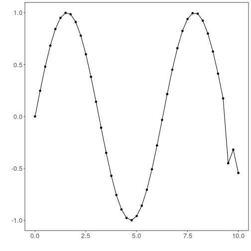

## Time Series Encoder


``` r
# DAL ToolBox
# version 1.1.737


#loading DAL
library(daltoolbox)
```

### Series for studying


``` r
data(sin_data)
sin_data$y[39] <- sin_data$y[39]*6
```


``` r
sw_size <- 5
ts <- ts_data(sin_data$y, sw_size)
ts_head(ts, 3)
```

```
##             t4        t3        t2        t1        t0
## [1,] 0.0000000 0.2474040 0.4794255 0.6816388 0.8414710
## [2,] 0.2474040 0.4794255 0.6816388 0.8414710 0.9489846
## [3,] 0.4794255 0.6816388 0.8414710 0.9489846 0.9974950
```


``` r
library(ggplot2)
plot_ts(x=sin_data$x, y=sin_data$y) + theme(text = element_text(size=16))
```



### data sampling


``` r
samp <- ts_sample(ts, test_size = 5)
train <- as.data.frame(samp$train)
test <- as.data.frame(samp$test)
```

### Model training


``` r
auto <- autoenc_e(5, 3)
auto <- fit(auto, train)
```

### Evaluation of encoding


``` r
print(head(train))
```

```
##          t4        t3        t2        t1        t0
## 1 0.0000000 0.2474040 0.4794255 0.6816388 0.8414710
## 2 0.2474040 0.4794255 0.6816388 0.8414710 0.9489846
## 3 0.4794255 0.6816388 0.8414710 0.9489846 0.9974950
## 4 0.6816388 0.8414710 0.9489846 0.9974950 0.9839859
## 5 0.8414710 0.9489846 0.9974950 0.9839859 0.9092974
## 6 0.9489846 0.9974950 0.9839859 0.9092974 0.7780732
```

``` r
result <- transform(auto, train)
print(head(result))
```

```
##            [,1]        [,2]        [,3]
## [1,] -0.7141446  0.42324191 -0.18081820
## [2,] -0.9860620  0.21519698 -0.02269202
## [3,] -1.1654260  0.02630274  0.14765424
## [4,] -1.2647659 -0.13255727  0.31620967
## [5,] -1.2876908 -0.24846761  0.47078276
## [6,] -1.2306385 -0.32878032  0.60867172
```

### Encoding of test


``` r
print(head(test))
```

```
##          t4        t3         t2         t1         t0
## 1 0.9893582 0.9226042  0.7984871  0.6247240  0.4121185
## 2 0.9226042 0.7984871  0.6247240  0.4121185  0.1738895
## 3 0.7984871 0.6247240  0.4121185  0.1738895 -0.4509067
## 4 0.6247240 0.4121185  0.1738895 -0.4509067 -0.3195192
## 5 0.4121185 0.1738895 -0.4509067 -0.3195192 -0.5440211
```

``` r
result <- transform(auto, test)
print(head(result))
```

```
##             [,1]       [,2]      [,3]
## [1,] -0.92972815 -0.3684396 0.7773674
## [2,] -0.68473130 -0.3452105 0.8293340
## [3,] -0.26251161 -0.4303343 1.0429269
## [4,]  0.06680822 -0.2402775 0.7321869
## [5,]  0.47189987 -0.2541093 0.8481219
```

