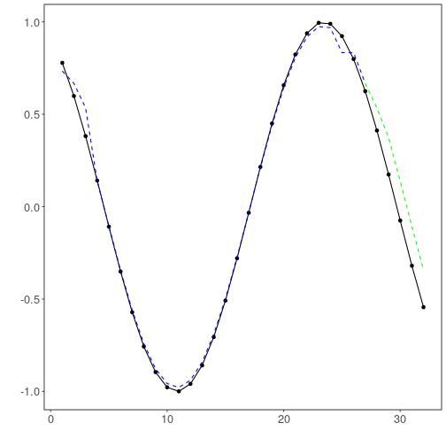

## Time Series regression - KNN


``` r
# DAL ToolBox
# version 1.1.737


#loading DAL
library(daltoolbox) 
```

### Series for studying


``` r
data(sin_data)
ts <- ts_data(sin_data$y, 10)
ts_head(ts, 3)
```

```
##             t9        t8        t7        t6        t5        t4        t3        t2        t1        t0
## [1,] 0.0000000 0.2474040 0.4794255 0.6816388 0.8414710 0.9489846 0.9974950 0.9839859 0.9092974 0.7780732
## [2,] 0.2474040 0.4794255 0.6816388 0.8414710 0.9489846 0.9974950 0.9839859 0.9092974 0.7780732 0.5984721
## [3,] 0.4794255 0.6816388 0.8414710 0.9489846 0.9974950 0.9839859 0.9092974 0.7780732 0.5984721 0.3816610
```


``` r
library(ggplot2)
plot_ts(x=sin_data$x, y=sin_data$y) + theme(text = element_text(size=16))
```


### data sampling


``` r
samp <- ts_sample(ts, test_size = 5)
io_train <- ts_projection(samp$train)
io_test <- ts_projection(samp$test)
```

### data preprocessing


``` r
preproc <- ts_norm_gminmax()
```

### Model training


``` r
model <- ts_knn(ts_norm_gminmax(), input_size=4, k=3)
model <- fit(model, x=io_train$input, y=io_train$output)
```

### Evaluation of adjustment


``` r
adjust <- predict(model, io_train$input)
adjust <- as.vector(adjust)
output <- as.vector(io_train$output)
ev_adjust <- evaluate(model, output, adjust)
ev_adjust$mse
```

```
## [1] 0.00169231
```

### Prediction of test


``` r
prediction <- predict(model, x=io_test$input[1,], steps_ahead=5)
prediction <- as.vector(prediction)
output <- as.vector(io_test$output)
ev_test <- evaluate(model, output, prediction)
ev_test
```

```
## $values
## [1]  0.41211849  0.17388949 -0.07515112 -0.31951919 -0.54402111
## 
## $prediction
## [1]  0.5349524  0.3737510  0.1381953 -0.1059528 -0.3435132
## 
## $smape
## [1] 0.8890066
## 
## $mse
## [1] 0.0372727
## 
## $R2
## [1] 0.6780737
## 
## $metrics
##         mse     smape        R2
## 1 0.0372727 0.8890066 0.6780737
```

### Plot results


``` r
yvalues <- c(io_train$output, io_test$output)
plot_ts_pred(y=yvalues, yadj=adjust, ypre=prediction) + theme(text = element_text(size=16))
```



