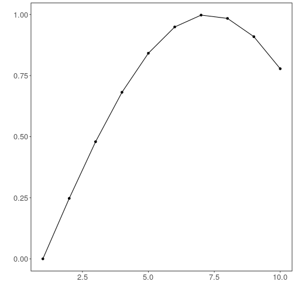

## Normalization Exponential Adaptive Normalization


``` r
# DAL ToolBox
# version 1.1.737


#loading DAL
library(daltoolbox) 
```

### Series for studying


``` r
data(sin_data)
```


``` r
library(ggplot2)
plot_ts(x=sin_data$x, y=sin_data$y) + theme(text = element_text(size=16))
```


### sliding windows


``` r
sw_size <- 10
ts <- ts_data(sin_data$y, sw_size)
ts_head(ts, 3)
```

```
##             t9        t8        t7        t6        t5        t4        t3        t2        t1        t0
## [1,] 0.0000000 0.2474040 0.4794255 0.6816388 0.8414710 0.9489846 0.9974950 0.9839859 0.9092974 0.7780732
## [2,] 0.2474040 0.4794255 0.6816388 0.8414710 0.9489846 0.9974950 0.9839859 0.9092974 0.7780732 0.5984721
## [3,] 0.4794255 0.6816388 0.8414710 0.9489846 0.9974950 0.9839859 0.9092974 0.7780732 0.5984721 0.3816610
```

``` r
summary(ts[,10])
```

```
##        t0          
##  Min.   :-0.99929  
##  1st Qu.:-0.55091  
##  Median : 0.05397  
##  Mean   : 0.02988  
##  3rd Qu.: 0.63279  
##  Max.   : 0.99460
```


``` r
library(ggplot2)
plot_ts(y=ts[,10]) + theme(text = element_text(size=16))
```


### normalization


``` r
preproc <- ts_norm_an()
preproc <- fit(preproc, ts)
tst <- transform(preproc, ts)
ts_head(tst, 3)
```

```
##             t9        t8        t7        t6        t5        t4        t3        t2        t1        t0
## [1,] 0.1770086 0.2931936 0.4021548 0.4971174 0.5721773 0.6226675 0.6454487 0.6391047 0.6040297 0.5424046
## [2,] 0.2650884 0.3740495 0.4690122 0.5440720 0.5945622 0.6173435 0.6109994 0.5759245 0.5142994 0.4299558
## [3,] 0.3677446 0.4627073 0.5377671 0.5882573 0.6110386 0.6046945 0.5696195 0.5079945 0.4236508 0.3218327
```

``` r
summary(tst[,10])
```

```
##        t0         
##  Min.   :0.04995  
##  1st Qu.:0.15185  
##  Median :0.41183  
##  Mean   :0.44854  
##  3rd Qu.:0.73197  
##  Max.   :0.94995
```

``` r
plot_ts(y=ts[1,]) + theme(text = element_text(size=16))
```



