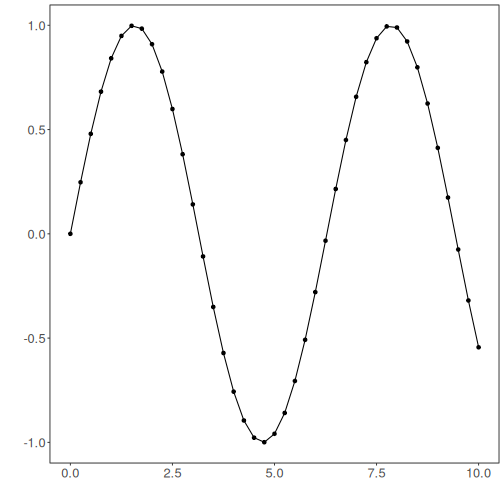
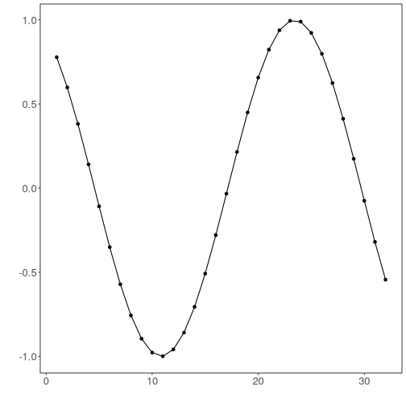
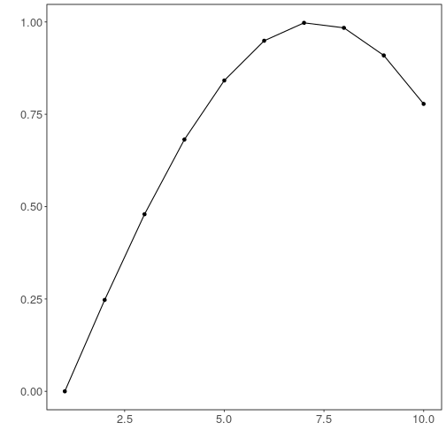

## Normalization Exponential Adaptive Normalization


``` r
# DAL ToolBox
# version 1.1.737


#loading DAL
library(daltoolbox) 
```

### Series for studying


``` r
data(sin_data)
```


``` r
library(ggplot2)
plot_ts(x=sin_data$x, y=sin_data$y) + theme(text = element_text(size=16))
```



### sliding windows


``` r
sw_size <- 10
ts <- ts_data(sin_data$y, sw_size)
ts_head(ts, 3)
```

```
##             t9        t8        t7        t6        t5        t4        t3        t2        t1        t0
## [1,] 0.0000000 0.2474040 0.4794255 0.6816388 0.8414710 0.9489846 0.9974950 0.9839859 0.9092974 0.7780732
## [2,] 0.2474040 0.4794255 0.6816388 0.8414710 0.9489846 0.9974950 0.9839859 0.9092974 0.7780732 0.5984721
## [3,] 0.4794255 0.6816388 0.8414710 0.9489846 0.9974950 0.9839859 0.9092974 0.7780732 0.5984721 0.3816610
```

``` r
summary(ts[,10])
```

```
##        t0          
##  Min.   :-0.99929  
##  1st Qu.:-0.55091  
##  Median : 0.05397  
##  Mean   : 0.02988  
##  3rd Qu.: 0.63279  
##  Max.   : 0.99460
```


``` r
library(ggplot2)
plot_ts(y=ts[,10]) + theme(text = element_text(size=16))
```



### normalization


``` r
preproc <- ts_norm_ean(nw = 3)
preproc <- fit(preproc, ts)
tst <- transform(preproc, ts)
ts_head(tst, 3)
```

```
##             t9        t8        t7        t6        t5        t4        t3        t2        t1        t0
## [1,] 0.2323665 0.3104452 0.3836695 0.4474864 0.4979282 0.5318587 0.5471682 0.5429048 0.5193337 0.4779203
## [2,] 0.3580339 0.4312581 0.4950750 0.5455169 0.5794473 0.5947568 0.5904935 0.5669224 0.5255090 0.4688283
## [3,] 0.4924682 0.5562851 0.6067269 0.6406574 0.6559669 0.6517035 0.6281324 0.5867191 0.5300384 0.4616144
```

``` r
summary(tst[,10])
```

```
##        t0        
##  Min.   :0.4545  
##  1st Qu.:0.4608  
##  Median :0.4804  
##  Mean   :0.4911  
##  3rd Qu.:0.5226  
##  Max.   :0.5437
```

``` r
plot_ts(y=ts[1,]) + theme(text = element_text(size=16))
```



