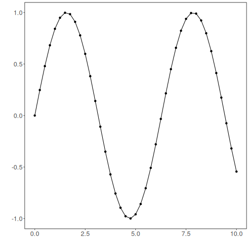

## Normalization Diff


``` r
# DAL ToolBox
# version 1.1.737


#loading DAL
library(daltoolbox) 
```

### Series for studying


``` r
data(sin_data)
```


``` r
library(ggplot2)
plot_ts(x=sin_data$x, y=sin_data$y) + theme(text = element_text(size=16))
```



### sliding windows


``` r
sw_size <- 10
ts <- ts_data(sin_data$y, sw_size)
ts_head(ts, 3)
```

```
##             t9        t8        t7        t6        t5        t4        t3        t2        t1        t0
## [1,] 0.0000000 0.2474040 0.4794255 0.6816388 0.8414710 0.9489846 0.9974950 0.9839859 0.9092974 0.7780732
## [2,] 0.2474040 0.4794255 0.6816388 0.8414710 0.9489846 0.9974950 0.9839859 0.9092974 0.7780732 0.5984721
## [3,] 0.4794255 0.6816388 0.8414710 0.9489846 0.9974950 0.9839859 0.9092974 0.7780732 0.5984721 0.3816610
```

``` r
summary(ts[,10])
```

```
##        t0          
##  Min.   :-0.99929  
##  1st Qu.:-0.55091  
##  Median : 0.05397  
##  Mean   : 0.02988  
##  3rd Qu.: 0.63279  
##  Max.   : 0.99460
```


``` r
library(ggplot2)
plot_ts(y=ts[,10]) + theme(text = element_text(size=16))
```


### normalization


``` r
preproc <- ts_norm_swminmax()
preproc <- fit(preproc, ts)
tst <- transform(preproc, ts)
ts_head(tst, 3)
```

```
##             t9        t8        t7        t6        t5        t4        t3        t2        t1        t0
## [1,] 0.0000000 0.2480253 0.4806295 0.6833506 0.8435842 0.9513678 1.0000000 0.9864570 0.9115809 0.7800272
## [2,] 0.0000000 0.3093246 0.5789095 0.7919932 0.9353274 1.0000000 0.9819901 0.8824175 0.7074731 0.4680341
## [3,] 0.1587515 0.4871082 0.7466460 0.9212282 1.0000000 0.9780638 0.8567835 0.6436998 0.3520610 0.0000000
```

``` r
summary(tst[,10])
```

```
##        t0        
##  Min.   :0.0000  
##  1st Qu.:0.0000  
##  Median :0.2264  
##  Mean   :0.4301  
##  3rd Qu.:0.9974  
##  Max.   :1.0000
```

``` r
plot_ts(y=ts[1,]) + theme(text = element_text(size=16))
```


