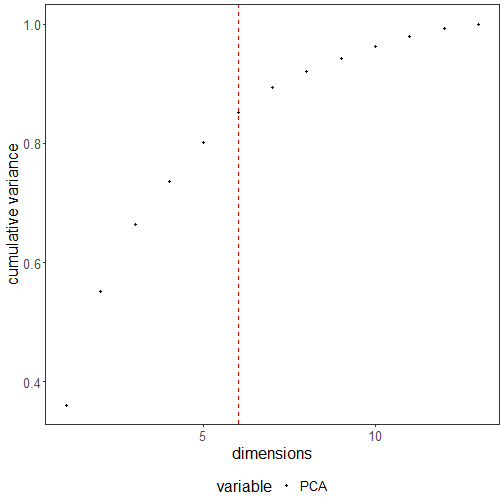

``` r
# installation 
#install.packages("daltoolbox")

# loading DAL
library(daltoolbox) 

# for ploting
library(ggplot2)
library(dplyr)
```


``` r
wine <- get(load(url("https://raw.githubusercontent.com/cefet-rj-dal/daltoolbox/main/develop/wine.RData")))
head(wine)
```

```
##   X1 X14.23 X1.71 X2.43 X15.6 X127 X2.8 X3.06 X.28 X2.29 X5.64 X1.04 X3.92 X1065
## 1  1  13.20  1.78  2.14  11.2  100 2.65  2.76 0.26  1.28  4.38  1.05  3.40  1050
## 2  1  13.16  2.36  2.67  18.6  101 2.80  3.24 0.30  2.81  5.68  1.03  3.17  1185
## 3  1  14.37  1.95  2.50  16.8  113 3.85  3.49 0.24  2.18  7.80  0.86  3.45  1480
## 4  1  13.24  2.59  2.87  21.0  118 2.80  2.69 0.39  1.82  4.32  1.04  2.93   735
## 5  1  14.20  1.76  2.45  15.2  112 3.27  3.39 0.34  1.97  6.75  1.05  2.85  1450
## 6  1  14.39  1.87  2.45  14.6   96 2.50  2.52 0.30  1.98  5.25  1.02  3.58  1290
```

# Example: PCA components
Cummulative variance of PCA: First dimensions have high variance. However, adding more dimensions does not bring much benefit in terms of cummulative variance. 
The goal is to establish a trade-off.


``` r
pca_res = prcomp(wine[,2:ncol(wine)], center=TRUE, scale.=TRUE)
y <- cumsum(pca_res$sdev^2/sum(pca_res$sdev^2))
x <- 1:length(y)
```


``` r
dat <- data.frame(x, value = y, variable = "PCA")
dat$variable <- as.factor(dat$variable)
head(dat)
```

```
##   x     value variable
## 1 1 0.3598307      PCA
## 2 2 0.5522435      PCA
## 3 3 0.6640381      PCA
## 4 4 0.7351492      PCA
## 5 5 0.8014366      PCA
## 6 6 0.8510403      PCA
```


``` r
grf <- plot_scatter(dat, label_x = "dimensions", label_y = "cumulative variance", colors="black") + 
    theme(text = element_text(size=16))
plot(grf)
```


# Minimum curvature
If the curve is increasing, use minimum curvature analysis. 
It brings a trade-off between having lower x values (with not so high y values) and having higher x values (not having to much increase in y values). 


``` r
myfit <- fit_curvature_min()
res <- transform(myfit, y)
head(res)
```

```
##   x         y          yfit
## 1 6 0.8510403 -1.819591e-08
```


``` r
plot(grf + geom_vline(xintercept = res$x, linetype="dashed", color = "red", size=0.5))
```



