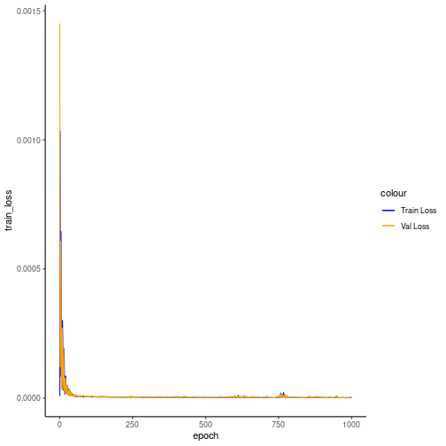

## Stacked Autoencoder transformation (encode-decode)

Considering a dataset with $p$ numerical attributes. 

The goal of the autoencoder is to reduce the dimension of $p$ to $k$, such that these $k$ attributes are enough to recompose the original $p$ attributes. However from the $k$ dimensionals the data is returned back to $p$ dimensions. The higher the quality of autoencoder the similiar is the output from the input. 


```r
# DAL ToolBox
# version 1.1.727


#loading DAL
library(daltoolbox)
library(ggplot2)
```

### dataset for example 


```r
data(sin_data)

sw_size <- 5
ts <- ts_data(sin_data$y, sw_size)

ts_head(ts)
```

```
##             t4        t3        t2        t1        t0
## [1,] 0.0000000 0.2474040 0.4794255 0.6816388 0.8414710
## [2,] 0.2474040 0.4794255 0.6816388 0.8414710 0.9489846
## [3,] 0.4794255 0.6816388 0.8414710 0.9489846 0.9974950
## [4,] 0.6816388 0.8414710 0.9489846 0.9974950 0.9839859
## [5,] 0.8414710 0.9489846 0.9974950 0.9839859 0.9092974
## [6,] 0.9489846 0.9974950 0.9839859 0.9092974 0.7780732
```

### applying data normalization


```r
preproc <- ts_norm_gminmax()
preproc <- fit(preproc, ts)
ts <- transform(preproc, ts)

ts_head(ts)
```

```
##             t4        t3        t2        t1        t0
## [1,] 0.5004502 0.6243512 0.7405486 0.8418178 0.9218625
## [2,] 0.6243512 0.7405486 0.8418178 0.9218625 0.9757058
## [3,] 0.7405486 0.8418178 0.9218625 0.9757058 1.0000000
## [4,] 0.8418178 0.9218625 0.9757058 1.0000000 0.9932346
## [5,] 0.9218625 0.9757058 1.0000000 0.9932346 0.9558303
## [6,] 0.9757058 1.0000000 0.9932346 0.9558303 0.8901126
```

### spliting into training and test


```r
samp <- ts_sample(ts, test_size = 10)
train <- as.data.frame(samp$train)
test <- as.data.frame(samp$test)
```

### creating autoencoder
Reduce from 5 to 3 dimensions


```r
auto <- sae_encode_decode(5, 3)

auto <- fit(auto, train)
```

### learning curves


```r
train_loss <- unlist(auto$model$train_loss)
val_loss <- unlist(auto$model$val_loss)

fit_loss <- as.data.frame(cbind(train_loss, val_loss))
fit_loss['epoch'] <- 1:nrow(fit_loss)

ggplot(fit_loss, aes(x=epoch)) +
geom_line(aes(y=train_loss, colour='Train Loss')) +
geom_line(aes(y=val_loss, colour='Val Loss')) +
scale_color_manual(values=c('Blue','Orange')) +
theme_classic()
```



### testing autoencoder
presenting the original test set and display encoding


```r
print(head(test))
```

```
##          t4        t3        t2        t1        t0
## 1 0.7258342 0.8294719 0.9126527 0.9702046 0.9985496
## 2 0.8294719 0.9126527 0.9702046 0.9985496 0.9959251
## 3 0.9126527 0.9702046 0.9985496 0.9959251 0.9624944
## 4 0.9702046 0.9985496 0.9959251 0.9624944 0.9003360
## 5 0.9985496 0.9959251 0.9624944 0.9003360 0.8133146
## 6 0.9959251 0.9624944 0.9003360 0.8133146 0.7068409
```

```r
result <- transform(auto, test)
print(head(result))
```

```
##           [,1]      [,2]      [,3]      [,4]      [,5]
## [1,] 0.7224818 0.8256268 0.9098378 0.9682459 0.9966129
## [2,] 0.8279027 0.9107848 0.9699773 0.9997109 0.9979848
## [3,] 0.9088370 0.9668884 0.9976182 0.9980465 0.9662305
## [4,] 0.9698365 0.9973639 0.9938344 0.9628411 0.8994545
## [5,] 0.9976737 0.9950266 0.9612733 0.9008633 0.8122675
## [6,] 0.9926600 0.9608967 0.9011275 0.8139324 0.7065960
```


```r
result <- as.data.frame(result)
names(result) <- names(test)
r2 <- c()
mape <- c()
for (col in names(test)){
r2_col <- cor(test[col], result[col])^2
r2 <- append(r2, r2_col)
mape_col <- mean((abs((result[col] - test[col]))/test[col])[[col]])
mape <- append(mape, mape_col)
print(paste(col, 'R2 test:', r2_col, 'MAPE:', mape_col))
}
```

```
## [1] "t4 R2 test: 0.999862735702142 MAPE: 0.00196742388400278"
## [1] "t3 R2 test: 0.999878880489194 MAPE: 0.00211845786994473"
## [1] "t2 R2 test: 0.999924485817891 MAPE: 0.00196280711577222"
## [1] "t1 R2 test: 0.999970999484556 MAPE: 0.00171794601758406"
## [1] "t0 R2 test: 0.999941470801393 MAPE: 0.00243220862391516"
```

```r
print(paste('Means R2 test:', mean(r2), 'MAPE:', mean(mape)))
```

```
## [1] "Means R2 test: 0.999915714459035 MAPE: 0.00203976870224379"
```

