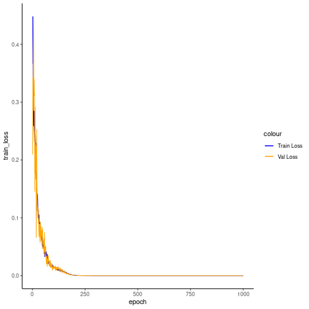

## Vanilla autoencoder transformation (encode)

Considering a dataset with $p$ numerical attributes. 

The goal of the autoencoder is to reduce the dimension of $p$ to $k$, such that these $k$ attributes are enough to recompose the original $p$ attributes. 


```r
# DAL ToolBox
# version 1.1.727


#loading DAL
library(daltoolbox)("daltoolbox")
```

```
## Error in eval(expr, envir, enclos): attempt to apply non-function
```

```r
library(ggplot2)
```

### dataset for example 


```r
data(sin_data)

sw_size <- 5
ts <- ts_data(sin_data$y, sw_size)

ts_head(ts)
```

```
##             t4        t3        t2        t1        t0
## [1,] 0.0000000 0.2474040 0.4794255 0.6816388 0.8414710
## [2,] 0.2474040 0.4794255 0.6816388 0.8414710 0.9489846
## [3,] 0.4794255 0.6816388 0.8414710 0.9489846 0.9974950
## [4,] 0.6816388 0.8414710 0.9489846 0.9974950 0.9839859
## [5,] 0.8414710 0.9489846 0.9974950 0.9839859 0.9092974
## [6,] 0.9489846 0.9974950 0.9839859 0.9092974 0.7780732
```

### applying data normalization


```r
preproc <- ts_norm_gminmax()
preproc <- fit(preproc, ts)
ts <- transform(preproc, ts)

ts_head(ts)
```

```
##             t4        t3        t2        t1        t0
## [1,] 0.5004502 0.6243512 0.7405486 0.8418178 0.9218625
## [2,] 0.6243512 0.7405486 0.8418178 0.9218625 0.9757058
## [3,] 0.7405486 0.8418178 0.9218625 0.9757058 1.0000000
## [4,] 0.8418178 0.9218625 0.9757058 1.0000000 0.9932346
## [5,] 0.9218625 0.9757058 1.0000000 0.9932346 0.9558303
## [6,] 0.9757058 1.0000000 0.9932346 0.9558303 0.8901126
```

### spliting into training and test


```r
samp <- ts_sample(ts, test_size = 10)
train <- as.data.frame(samp$train)
test <- as.data.frame(samp$test)
```

### creating autoencoder
Reduce from 5 to 3 dimensions


```r
auto <- autoenc_encode(5, 3)

auto <- fit(auto, train)
```

### learning curves


```r
train_loss <- unlist(auto$model$train_loss)
val_loss <- unlist(auto$model$val_loss)

fit_loss <- as.data.frame(cbind(train_loss, val_loss))
fit_loss['epoch'] <- 1:nrow(fit_loss)

ggplot(fit_loss, aes(x=epoch)) +
geom_line(aes(y=train_loss, colour='Train Loss')) +
geom_line(aes(y=val_loss, colour='Val Loss')) +
scale_color_manual(values=c('Blue','Orange')) +
theme_classic()
```



### testing autoencoder
presenting the original test set and display encoding


```r
print(head(test))
```

```
##          t4        t3        t2        t1        t0
## 1 0.7258342 0.8294719 0.9126527 0.9702046 0.9985496
## 2 0.8294719 0.9126527 0.9702046 0.9985496 0.9959251
## 3 0.9126527 0.9702046 0.9985496 0.9959251 0.9624944
## 4 0.9702046 0.9985496 0.9959251 0.9624944 0.9003360
## 5 0.9985496 0.9959251 0.9624944 0.9003360 0.8133146
## 6 0.9959251 0.9624944 0.9003360 0.8133146 0.7068409
```

```r
result <- transform(auto, test)
print(head(result))
```

```
##            [,1]       [,2]      [,3]
## [1,] -0.5689122 -0.3040708 -2.053079
## [2,] -0.5449437 -0.4239701 -2.148781
## [3,] -0.5023268 -0.5311267 -2.179630
## [4,] -0.4435885 -0.6183596 -2.144176
## [5,] -0.3720020 -0.6809745 -2.045215
## [6,] -0.2895588 -0.7161682 -1.886804
```

